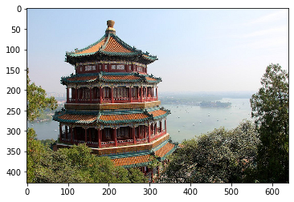
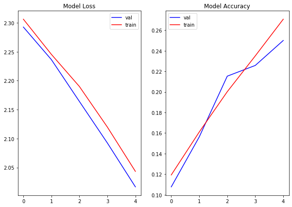
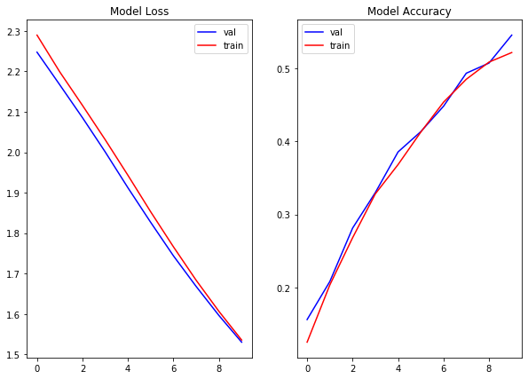
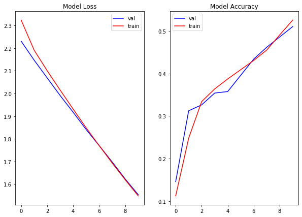
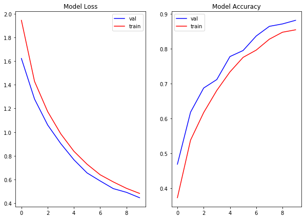
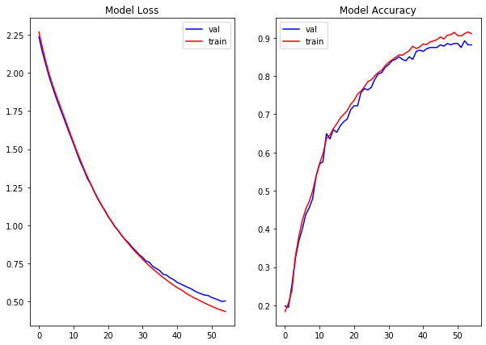
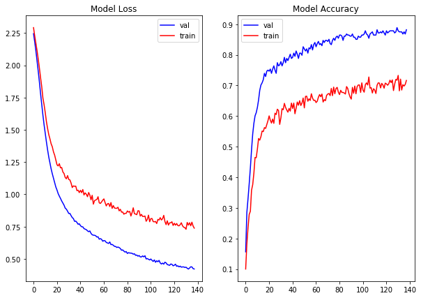
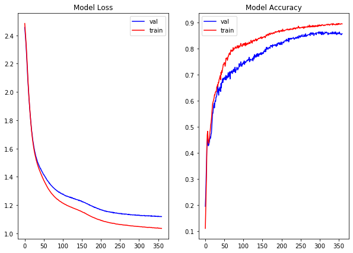

# Tensorflow and Keras


```python
import numpy as np
from matplotlib import pyplot as plt


# This is always a good idea
%load_ext autoreload
%autoreload 2
    
from src.student_caller import one_random_student, three_random_students
from src.student_list import student_first_names
import warnings
warnings.filterwarnings('ignore')
```

## Modeling

Let's review some modeling concepts we've used to date with [this quick exercise](https://forms.gle/yrPxUp2Xj4R9FeyEA)


We do this to remind ourselves that the basic components of good modeling practice, and even the methods themselves, are _the same_ with Neural Nets as that are with _sklearn_ or _statsmodels_.

The above exercise uses only one train-test split, but is still useful.  We will be using train, validation, test in this notebook, for good practice.

## Objectives:
- Compare pros and cons of Keras vs TensorFlow
- hands on practice coding a neural network


```python
import keras
```

Wait a second, what is that warning? 
`Using TensorFlow backend.`

<br>
### Keras is an API

Coded in Python, that can be layered on top of many different back-end processing systems.


While each of these systems has their own coding methods, Keras abstracts from that in streamlined pythonic manner we are used to seeing in other python modeling libraries.

Keras development is backed primarily by Google, and the Keras API comes packaged in TensorFlow as tf.keras. Additionally, Microsoft maintains the CNTK Keras backend. Amazon AWS is maintaining the Keras fork with MXNet support. Other contributing companies include NVIDIA, Uber, and Apple (with CoreML).

Theano has been discontinued.  The last release was 2017, but can still be used.

We will use TensorFlow, as it is the most popular. TensorFlow became the most used Keras backend, and  eventually integrated Keras into via the tf.keras submodule of TensorFlow.  

## Wait, what's TensorFlow?


## Let's start with tensors

## Tensors are multidimensional matricies


### TensorFlow manages the flow of matrix math

That makes neural network processing possible.


For our numbers dataset, our tensors from the sklearn dataset were originally tensors of the shape 8x8, i.e.64 pictures.  Remember, that was with black and white images.

For image processing, we are often dealing with color.


```python
from sklearn.datasets import load_sample_images
image = load_sample_images()['images'][0]
```


```python
import matplotlib.pyplot as plt
import matplotlib.image as mpimg

imgplot = plt.imshow(image)
```





```python
image.shape
```


    (427, 640, 3)


What do the dimensions of our image above represent?


```python
one_random_student(student_first_names)
```

    Andrew


Tensors with higher numbers of dimensions have a higher **rank**, in the language of TensorFlow.

A matrix with rows and columns only, like the black and white numbers, are **rank 2**.

A matrix with a third dimension, like the color pictures above, are **rank 3**.

When we flatten an image by stacking the rows in a column, we are decreasing the rank. 


```python
flat_image = image.reshape(-1,1)
```

When we unrow a column, we increase its rank.


```python
unrowed = flat_image.reshape(427,640, -1)
```


```python
imgplot = plt.imshow(unrowed)
```


## TensorFLow has more levers and buttons, but Keras is more user friendly

Coding directly in **Tensorflow** allows you to tweak more parameters to optimize performance. The **Keras** wrapper makes the code more accessible for developers prototyping models.


### Keras, an API with an intentional UX

- Deliberately design end-to-end user workflows
- Reduce cognitive load for your users
- Provide helpful feedback to your users

[full article here](https://blog.keras.io/user-experience-design-for-apis.html)<br>
[full list of why to use Keras](https://keras.io/why-use-keras/)

### A few comparisons

While you **can leverage both**, here are a few comparisons.

| Comparison | Keras | Tensorflow|
|------------|-------|-----------|
| **Level of API** | high-level API | High and low-level APIs |
| **Speed** |  can *seem* slower |  is a bit faster |
| **Language architecture** | simple architecture, more readable and concise | straight tensorflow is a bit more complex |
| **Debugging** | less frequent need to debug | difficult to debug |
| **Datasets** | usually used for small datasets | high performance models and large datasets that require fast execution|

This is also a _**non-issue**_ - as you can leverage tensorflow commands within keras and vice versa. If Keras ever seems slower, it's because the developer's time is more expensive than the GPUs. Keras is designed with the developer in mind. 


[reference link](https://www.edureka.co/blog/keras-vs-tensorflow-vs-pytorch/)

# Now let's get our feet wet

Let's import the numbers dataset we used this morning.


```python
from sklearn.datasets import load_digits
from sklearn.model_selection import train_test_split
digits = load_digits()
X = digits.data
y = digits.target

```

#### Getting data ready for modeling
**Preprocessing**:

- use train_test_split to create X_train, y_train, X_test, and y_test
- Split training data into train and validation sets.
- Scale the pixel intensity to a value between 0 and 1.
- Scale the pixel intensity to a value between 0 and 1.


Scaling our input variables will help speed up our neural network [see 4.3](http://yann.lecun.com/exdb/publis/pdf/lecun-98b.pdf)

Since our minimum intensity is 0, we can normalize the inputs by dividing each value by the max value (16). 


```python
from sklearn.model_selection import train_test_split

X_train, X_test, y_train, y_test = train_test_split(X, y, random_state=42, test_size=.2)
X_t, X_val, y_t, y_val = train_test_split(X_train, y_train, random_state=42, test_size=.2)
X_t, X_val, X_test = X_t/16, X_val/16, X_test/16

```

Now that our data is ready, let's load in the keras Sequential class.  

In this lesson, we are only proceeding with feed forward models.  Our network proceeds layer by layer in sequence.

Sequential refers to a sequence of layers that feed directly into one another with exactly [one input tensor and one output tensor](https://www.tensorflow.org/guide/keras/sequential_model)


```python
# Import the Sequential model from the models module

# Instantiate an instance of the Sequential model
```


```python

```

Now we want to specify the type for our first hidden layer.

To begin, we will only deal with dense layers.  Remember, dense means fully connected.  Every neuron passes a signal to every neuron in the next layer.


```python
# Import Dense from keras.layers

```


```python

```

As we will see, building neural networks is a highly empirical process.  There are numerous architectural choices to be made whose impact is hard to predict.  One has to proceed systematically, keeping track of the changes to the architure made along the way, tweeking the hyperparameters and layers until a good model is found.

That being said, some aspects of our model require specific components. 

For our first hidden layer, we need to specify both the number of neurons in the layer, the activation function, and the dimensions of our input.

Out of those three choices, which is non-negotiable?


```python
one_random_student(student_first_names)
```

    Elena


```python
# We use model.add to add a layer.  Pass Dense() to model.add, with the parameters specified above
# hints: 'sigmoid', 'input_dim'


```

Next, we have to specify our output layer.

To do so, we have to choose an appropriate activation function which mirrors the sample space of our potential outcomes.

What activation should we use for our output layer?


```python
one_random_student(student_first_names)
```

    Karim


```python
# add another layer with the appropriate units and activation function. 
# We use the same syntax as the first hidden layer

```

Lastly, for this simple model, we have to define a loss function, a metric, and an optimizer.

Optimizers are functions which update our weights in smart ways instead of treating all parameters equaly. Adam, a popular optimizer, calculates an individual learning rate for each parameter. Here is a list of available optimizers in Keras: [optimizers](https://keras.io/api/optimizers/)

We specify these parameters in the compile method.

Looking back at this morning's lecture, what loss function should we use?


```python
one_random_student(student_first_names)
```

    Sam


Now we can fit our model in a similar way as we did our sklearn models, using a .fit method.

Before we do so, we have to convert out target values with a One Hot Encoder, which is the form Keras requires. 


```python
# pass y_t.reshape(-1,1) into the fit_transform method of a OneHotEncoder

y_t_ohe = None
```


```python
# pass X_t and y_t_ohe to the model's fit method

```

How did we do? Keras behaves in a way which makes replication across computers difficult, even if we were to add a random seed.  In other words may get slightly varying results.

The model once fit now has the ability to both predict and predict_classes


```python
# Try both methods out with X_val
```

Instead of checking the performance on val each time with the above methods, we can score our validation data along with the training data by passing it as a tuple as the validation_data parameter in our .fit 

But first, we have to transform y_val like we did y_t.


```python
# Transform y_val with the ohe object from above
```


```python
# Now, call the .fit() method again with the validation data.
```

How did we do on the validation data?

Now that we have our input and output layers set, let's try to boost our accuracy.

To begin, let's allow our algorithm to train for a longer.  To do so, we increase the epochs using the `epochs` parameter in .fit(). Let's change it to 5.


```python
# Increase our epochs to 5
```

Now our loss is going down and accuracy is going up a bit. 

Let's plot our loss across epochs. In order to do that, we have to store the results of our model.


```python
# instead of simply calling model.fit(), assign it to a variable results

results = None
```


```python
# Now take a look at results.history

```

We can track the loss and accuracy from each epoch to get a sense of our model's progress.


```python
# We can now plot our loss and accuracy against results.epoch

def plot_results(results):
    
    '''
    After running a model, plot the training and validation
    scores for both loss and accuracy.
    '''
    
    val_loss = results.history['val_loss']
    train_loss = results.history['loss']

    val_accuracy = results.history['val_accuracy']
    train_accuracy = results.history['accuracy']
    
    fig, ax = plt.subplots(1,2, figsize=(10,7))

    ax[0].plot(results.epoch, val_loss, c='b', label='val')
    ax[0].plot(results.epoch, train_loss, c='r', label='train')
    ax[0].legend()
    ax[0].set_title('Model Loss')

    ax[1].plot(results.epoch, val_accuracy, c='b', label='val')
    ax[1].plot(results.epoch, train_accuracy, c='r', label='train')
    ax[1].set_title('Model Accuracy')

    ax[1].legend()
    

plot_results(results)
```





Our goal in modeling is to minimize the loss while maximizing accuracy. Remember, our models don't actually optimize for the metric we assign: they learn by minimizing the loss.  We can get a sense as to whether our model has converged on a minimim by seeing whether our loss has stopped decreasing.  The plots of epochs vs loss will level off.

With this goal in mind, let's start testing out some different architectures and parameters.
Remember, this is an empirical process.  We experiment with educated guesses as to what may improve our model's performance.

A first logical step would be to allow our model to learn for a longer.


```python
# Here is the current state of our model, along with all the code we need to make our model run.

# Let's see what happens if we up our fit to 10 epochs

from keras.models import Sequential
from keras.layers import Dense
from sklearn.preprocessing import OneHotEncoder

ohe = OneHotEncoder(sparse=False)
y_t_ohe = ohe.fit_transform(y_t.reshape(-1,1))
y_val_ohe = ohe.transform(y_val.reshape(-1,1))

model = Sequential()
model.add(Dense(units=4, activation='relu', input_dim=64))
model.add(Dense(units=10, activation='softmax'))
model.compile(optimizer="Adam", loss='categorical_crossentropy', metrics=['accuracy'])
results = model.fit(X_t, y_t_ohe, validation_data=(X_val, y_val_ohe), epochs=5)
```

    WARNING:tensorflow:From /Users/johnmaxbarry/anaconda3/envs/learn-env_2/lib/python3.6/site-packages/keras/backend/tensorflow_backend.py:422: The name tf.global_variables is deprecated. Please use tf.compat.v1.global_variables instead.
    
    Train on 1149 samples, validate on 288 samples
    Epoch 1/5
    1149/1149 [==============================] - 0s 395us/step - loss: 2.3062 - accuracy: 0.1192 - val_loss: 2.2926 - val_accuracy: 0.1076
    Epoch 2/5
    1149/1149 [==============================] - 0s 44us/step - loss: 2.2454 - accuracy: 0.1610 - val_loss: 2.2364 - val_accuracy: 0.1562
    Epoch 3/5
    1149/1149 [==============================] - 0s 42us/step - loss: 2.1900 - accuracy: 0.2002 - val_loss: 2.1641 - val_accuracy: 0.2153
    Epoch 4/5
    1149/1149 [==============================] - 0s 42us/step - loss: 2.1198 - accuracy: 0.2350 - val_loss: 2.0923 - val_accuracy: 0.2257
    Epoch 5/5
    1149/1149 [==============================] - 0s 45us/step - loss: 2.0433 - accuracy: 0.2707 - val_loss: 2.0166 - val_accuracy: 0.2500


```python
plot_results(results)
```


Instead of adding more epochs, let's deepen our network by adding another hidden layer. It is a good idea to try out deep networks, since we know that successive layers find increasingly complex patterns.


```python
model = Sequential()
model.add(Dense(units=4, activation='relu', input_dim=64))
# add another Dense layer. Try out 6 units and 'relu' activation
model.add(Dense(units=10, activation='softmax'))
model.compile(optimizer="Adam", loss='categorical_crossentropy', metrics=['accuracy'])
results = model.fit(X_t, y_t_ohe, validation_data=(X_val, y_val_ohe), epochs=10)
plot_results(results)
```

    Train on 1149 samples, validate on 288 samples
    Epoch 1/10
    1149/1149 [==============================] - 0s 397us/step - loss: 2.3142 - accuracy: 0.1036 - val_loss: 2.2872 - val_accuracy: 0.1111
    Epoch 2/10
    1149/1149 [==============================] - 0s 45us/step - loss: 2.2807 - accuracy: 0.1401 - val_loss: 2.2596 - val_accuracy: 0.1458
    Epoch 3/10
    1149/1149 [==============================] - 0s 92us/step - loss: 2.2464 - accuracy: 0.1567 - val_loss: 2.2214 - val_accuracy: 0.1493
    Epoch 4/10
    1149/1149 [==============================] - 0s 40us/step - loss: 2.2004 - accuracy: 0.1680 - val_loss: 2.1620 - val_accuracy: 0.1806
    Epoch 5/10
    1149/1149 [==============================] - 0s 46us/step - loss: 2.1308 - accuracy: 0.2124 - val_loss: 2.0810 - val_accuracy: 0.2465
    Epoch 6/10
    1149/1149 [==============================] - 0s 42us/step - loss: 2.0476 - accuracy: 0.2628 - val_loss: 1.9976 - val_accuracy: 0.2847
    Epoch 7/10
    1149/1149 [==============================] - 0s 41us/step - loss: 1.9688 - accuracy: 0.3090 - val_loss: 1.9199 - val_accuracy: 0.3264
    Epoch 8/10
    1149/1149 [==============================] - 0s 42us/step - loss: 1.8938 - accuracy: 0.3299 - val_loss: 1.8468 - val_accuracy: 0.3785
    Epoch 9/10
    1149/1149 [==============================] - 0s 46us/step - loss: 1.8215 - accuracy: 0.3542 - val_loss: 1.7744 - val_accuracy: 0.3889
    Epoch 10/10
    1149/1149 [==============================] - 0s 39us/step - loss: 1.7524 - accuracy: 0.3916 - val_loss: 1.7050 - val_accuracy: 0.4479


```python
Try out the tanh activation function
```


```python
model = Sequential()
# try out the tanh activation
model.add(Dense(units=4, activation='tanh', input_dim=64))
model.add(Dense(units=6, activation='tanh'))
model.add(Dense(units=10, activation='softmax'))
model.compile(optimizer="Adam", loss='categorical_crossentropy', metrics=['accuracy'])
results = model.fit(X_t, y_t_ohe, validation_data=(X_val, y_val_ohe), epochs=10)
plot_results(results)
```

    Train on 1149 samples, validate on 288 samples
    Epoch 1/10
    1149/1149 [==============================] - 1s 492us/step - loss: 2.2898 - accuracy: 0.1253 - val_loss: 2.2476 - val_accuracy: 0.1562
    Epoch 2/10
    1149/1149 [==============================] - 0s 53us/step - loss: 2.1988 - accuracy: 0.2037 - val_loss: 2.1669 - val_accuracy: 0.2083
    Epoch 3/10
    1149/1149 [==============================] - 0s 52us/step - loss: 2.1159 - accuracy: 0.2681 - val_loss: 2.0854 - val_accuracy: 0.2812
    Epoch 4/10
    1149/1149 [==============================] - 0s 51us/step - loss: 2.0309 - accuracy: 0.3281 - val_loss: 2.0007 - val_accuracy: 0.3299
    Epoch 5/10
    1149/1149 [==============================] - 0s 56us/step - loss: 1.9428 - accuracy: 0.3681 - val_loss: 1.9119 - val_accuracy: 0.3854
    Epoch 6/10
    1149/1149 [==============================] - 0s 57us/step - loss: 1.8525 - accuracy: 0.4125 - val_loss: 1.8265 - val_accuracy: 0.4132
    Epoch 7/10
    1149/1149 [==============================] - 0s 48us/step - loss: 1.7659 - accuracy: 0.4534 - val_loss: 1.7436 - val_accuracy: 0.4479
    Epoch 8/10
    1149/1149 [==============================] - 0s 53us/step - loss: 1.6831 - accuracy: 0.4848 - val_loss: 1.6678 - val_accuracy: 0.4931
    Epoch 9/10
    1149/1149 [==============================] - 0s 45us/step - loss: 1.6063 - accuracy: 0.5083 - val_loss: 1.5961 - val_accuracy: 0.5069
    Epoch 10/10
    1149/1149 [==============================] - 0s 49us/step - loss: 1.5353 - accuracy: 0.5213 - val_loss: 1.5300 - val_accuracy: 0.5451





Without knowing, we have been performing batch gradient descent.  Let's try out mini-batch gradient descent.

To do so, we add a batch size to our fit.

As a favorite blogger, Jason Brownlee suggests:

Mini-batch sizes, commonly called “batch sizes” for brevity, are often tuned to an aspect of the computational architecture on which the implementation is being executed. Such as a power of two that fits the memory requirements of the GPU or CPU hardware like 32, 64, 128, 256, and so on. [source](https://machinelearningmastery.com/gentle-introduction-mini-batch-gradient-descent-configure-batch-size/)


```python
model = Sequential()
model.add(Dense(units=4, activation='tanh', input_dim=64))
model.add(Dense(units=6, activation='tanh'))
model.add(Dense(units=10, activation='softmax'))
model.compile(optimizer="Adam", loss='categorical_crossentropy', metrics=['accuracy'])
# Add a batch_size to our fit. Try 32
results = model.fit(X_t, y_t_ohe, validation_data=(X_val, y_val_ohe), epochs=10)
plot_results(results)
```

    Train on 1149 samples, validate on 288 samples
    Epoch 1/10
    1149/1149 [==============================] - 1s 546us/step - loss: 2.3237 - accuracy: 0.1123 - val_loss: 2.2307 - val_accuracy: 0.1458
    Epoch 2/10
    1149/1149 [==============================] - 0s 72us/step - loss: 2.1908 - accuracy: 0.2480 - val_loss: 2.1468 - val_accuracy: 0.3125
    Epoch 3/10
    1149/1149 [==============================] - 0s 50us/step - loss: 2.1004 - accuracy: 0.3342 - val_loss: 2.0688 - val_accuracy: 0.3264
    Epoch 4/10
    1149/1149 [==============================] - 0s 48us/step - loss: 2.0148 - accuracy: 0.3638 - val_loss: 1.9908 - val_accuracy: 0.3542
    Epoch 5/10
    1149/1149 [==============================] - 0s 47us/step - loss: 1.9311 - accuracy: 0.3873 - val_loss: 1.9171 - val_accuracy: 0.3576
    Epoch 6/10
    1149/1149 [==============================] - 0s 46us/step - loss: 1.8484 - accuracy: 0.4091 - val_loss: 1.8410 - val_accuracy: 0.3958
    Epoch 7/10
    1149/1149 [==============================] - 0s 52us/step - loss: 1.7699 - accuracy: 0.4308 - val_loss: 1.7703 - val_accuracy: 0.4340
    Epoch 8/10
    1149/1149 [==============================] - 0s 59us/step - loss: 1.6932 - accuracy: 0.4552 - val_loss: 1.6980 - val_accuracy: 0.4618
    Epoch 9/10
    1149/1149 [==============================] - 0s 57us/step - loss: 1.6194 - accuracy: 0.4909 - val_loss: 1.6229 - val_accuracy: 0.4861
    Epoch 10/10
    1149/1149 [==============================] - 0s 60us/step - loss: 1.5484 - accuracy: 0.5257 - val_loss: 1.5539 - val_accuracy: 0.5104





We can also try true stochastic gradient descent by specifying 1 as the batch size.


```python
model = Sequential()
model.add(Dense(units=4, activation='tanh', input_dim=64))
model.add(Dense(units=6, activation='tanh'))
model.add(Dense(units=10, activation='softmax'))
model.compile(optimizer="SGD", loss='categorical_crossentropy', metrics=['accuracy'])
# for Stochastic gradient descent, add a batch size of 1
results = model.fit(X_t, y_t_ohe, validation_data=(X_val, y_val_ohe), epochs=10)
plot_results(results)
```

    Train on 1149 samples, validate on 288 samples
    Epoch 1/10
    1149/1149 [==============================] - 2s 2ms/step - loss: 1.9445 - accuracy: 0.3725 - val_loss: 1.6221 - val_accuracy: 0.4688
    Epoch 2/10
    1149/1149 [==============================] - 2s 1ms/step - loss: 1.4287 - accuracy: 0.5379 - val_loss: 1.2796 - val_accuracy: 0.6181
    Epoch 3/10
    1149/1149 [==============================] - 2s 1ms/step - loss: 1.1734 - accuracy: 0.6171 - val_loss: 1.0605 - val_accuracy: 0.6875
    Epoch 4/10
    1149/1149 [==============================] - 2s 1ms/step - loss: 0.9853 - accuracy: 0.6806 - val_loss: 0.9026 - val_accuracy: 0.7118
    Epoch 5/10
    1149/1149 [==============================] - 2s 1ms/step - loss: 0.8380 - accuracy: 0.7337 - val_loss: 0.7665 - val_accuracy: 0.7778
    Epoch 6/10
    1149/1149 [==============================] - 2s 2ms/step - loss: 0.7289 - accuracy: 0.7755 - val_loss: 0.6552 - val_accuracy: 0.7951
    Epoch 7/10
    1149/1149 [==============================] - 2s 2ms/step - loss: 0.6394 - accuracy: 0.7963 - val_loss: 0.5875 - val_accuracy: 0.8368
    Epoch 8/10
    1149/1149 [==============================] - 2s 2ms/step - loss: 0.5793 - accuracy: 0.8277 - val_loss: 0.5226 - val_accuracy: 0.8646
    Epoch 9/10
    1149/1149 [==============================] - 2s 1ms/step - loss: 0.5251 - accuracy: 0.8477 - val_loss: 0.4913 - val_accuracy: 0.8715
    Epoch 10/10
    1149/1149 [==============================] - 2s 2ms/step - loss: 0.4821 - accuracy: 0.8547 - val_loss: 0.4458 - val_accuracy: 0.8819





Since a SGD batchsize seems to work well, but takes a relatively long time, let's try a slightly bigger batch size of 5 and boost the epochs to 50.  Hopefully, this will allow us to achieve similarly good results as SGD, but in a reasonable amount of time.


```python
model = Sequential()
opt = keras.optimizers.Adam(learning_rate=0.01)

model.add(Dense(units=4, activation='tanh', input_dim=64))
model.add(Dense(units=6, activation='tanh'))
model.add(Dense(units=10, activation='softmax'))
model.compile(optimizer=opt, loss='categorical_crossentropy', metrics=['accuracy'])
# Change batch size to 5 and epochs to 50
results = model.fit(X_t, y_t_ohe, validation_data=(X_val, y_val_ohe), epochs=50, batch_size=5)
plot_results(results)
```

Now we're talking.  We are beginnig to see a leveling off of our validation loss, indicating that we may be close to converging on a minimum.

But as you may notice, the validation loss is beginning to separate from the training loss.

Let's run this a bit longer, and see what happens


```python
model = Sequential()
model.add(Dense(units=4, activation='tanh', input_dim=64))
model.add(Dense(units=6, activation='tanh'))
model.add(Dense(units=10, activation='softmax'))
model.compile(optimizer="Adam", loss='categorical_crossentropy', metrics=['accuracy'])
# Up the epochs to 150
results = model.fit(X_t, y_t_ohe, validation_data=(X_val, y_val_ohe), epochs=50, batch_size=5)
plot_results(results)
```

    Train on 1149 samples, validate on 288 samples
    Epoch 1/150
    1149/1149 [==============================] - 1s 826us/step - loss: 2.2632 - accuracy: 0.1593 - val_loss: 2.1374 - val_accuracy: 0.2083
    Epoch 2/150
    1149/1149 [==============================] - 0s 294us/step - loss: 1.9715 - accuracy: 0.3238 - val_loss: 1.8509 - val_accuracy: 0.4201
    Epoch 3/150
    1149/1149 [==============================] - 0s 291us/step - loss: 1.6991 - accuracy: 0.4543 - val_loss: 1.6234 - val_accuracy: 0.4514
    Epoch 4/150
    1149/1149 [==============================] - 0s 305us/step - loss: 1.4878 - accuracy: 0.5265 - val_loss: 1.4457 - val_accuracy: 0.5556
    Epoch 5/150
    1149/1149 [==============================] - 0s 289us/step - loss: 1.3155 - accuracy: 0.6075 - val_loss: 1.2916 - val_accuracy: 0.6771
    Epoch 6/150
    1149/1149 [==============================] - 0s 296us/step - loss: 1.1776 - accuracy: 0.6858 - val_loss: 1.1787 - val_accuracy: 0.7083
    Epoch 7/150
    1149/1149 [==============================] - 0s 312us/step - loss: 1.0696 - accuracy: 0.7224 - val_loss: 1.0899 - val_accuracy: 0.7292
    Epoch 8/150
    1149/1149 [==============================] - 0s 291us/step - loss: 0.9790 - accuracy: 0.7493 - val_loss: 1.0107 - val_accuracy: 0.7257
    Epoch 9/150
    1149/1149 [==============================] - 0s 306us/step - loss: 0.8975 - accuracy: 0.7624 - val_loss: 0.9299 - val_accuracy: 0.7361
    Epoch 10/150
    1149/1149 [==============================] - 0s 308us/step - loss: 0.8278 - accuracy: 0.7781 - val_loss: 0.8733 - val_accuracy: 0.7326
    Epoch 11/150
    1149/1149 [==============================] - 0s 293us/step - loss: 0.7706 - accuracy: 0.7946 - val_loss: 0.8144 - val_accuracy: 0.7604
    Epoch 12/150
    1149/1149 [==============================] - 0s 300us/step - loss: 0.7189 - accuracy: 0.8042 - val_loss: 0.7615 - val_accuracy: 0.7743
    Epoch 13/150
    1149/1149 [==============================] - 0s 327us/step - loss: 0.6720 - accuracy: 0.8259 - val_loss: 0.7175 - val_accuracy: 0.7951
    Epoch 14/150
    1149/1149 [==============================] - 0s 301us/step - loss: 0.6327 - accuracy: 0.8277 - val_loss: 0.6846 - val_accuracy: 0.8021
    Epoch 15/150
    1149/1149 [==============================] - 0s 299us/step - loss: 0.5975 - accuracy: 0.8364 - val_loss: 0.6495 - val_accuracy: 0.8125
    Epoch 16/150
    1149/1149 [==============================] - 0s 310us/step - loss: 0.5657 - accuracy: 0.8460 - val_loss: 0.6134 - val_accuracy: 0.8368
    Epoch 17/150
    1149/1149 [==============================] - 0s 291us/step - loss: 0.5371 - accuracy: 0.8460 - val_loss: 0.5978 - val_accuracy: 0.8264
    Epoch 18/150
    1149/1149 [==============================] - 0s 311us/step - loss: 0.5125 - accuracy: 0.8547 - val_loss: 0.5746 - val_accuracy: 0.8472
    Epoch 19/150
    1149/1149 [==============================] - 0s 302us/step - loss: 0.4901 - accuracy: 0.8564 - val_loss: 0.5501 - val_accuracy: 0.8576
    Epoch 20/150
    1149/1149 [==============================] - 0s 319us/step - loss: 0.4658 - accuracy: 0.8729 - val_loss: 0.5343 - val_accuracy: 0.8507
    Epoch 21/150
    1149/1149 [==============================] - 0s 319us/step - loss: 0.4489 - accuracy: 0.8738 - val_loss: 0.5038 - val_accuracy: 0.8681
    Epoch 22/150
    1149/1149 [==============================] - 0s 319us/step - loss: 0.4297 - accuracy: 0.8834 - val_loss: 0.4847 - val_accuracy: 0.8681
    Epoch 23/150
    1149/1149 [==============================] - 0s 332us/step - loss: 0.4150 - accuracy: 0.8816 - val_loss: 0.4776 - val_accuracy: 0.8785
    Epoch 24/150
    1149/1149 [==============================] - 0s 342us/step - loss: 0.3993 - accuracy: 0.8921 - val_loss: 0.4513 - val_accuracy: 0.8854
    Epoch 25/150
    1149/1149 [==============================] - 0s 334us/step - loss: 0.3814 - accuracy: 0.8964 - val_loss: 0.4677 - val_accuracy: 0.8646
    Epoch 26/150
    1149/1149 [==============================] - 0s 371us/step - loss: 0.3717 - accuracy: 0.8930 - val_loss: 0.4318 - val_accuracy: 0.8819
    Epoch 27/150
    1149/1149 [==============================] - 0s 345us/step - loss: 0.3607 - accuracy: 0.8956 - val_loss: 0.4203 - val_accuracy: 0.8785
    Epoch 28/150
    1149/1149 [==============================] - 0s 339us/step - loss: 0.3470 - accuracy: 0.9060 - val_loss: 0.4203 - val_accuracy: 0.8715
    Epoch 29/150
    1149/1149 [==============================] - 0s 357us/step - loss: 0.3397 - accuracy: 0.9034 - val_loss: 0.4062 - val_accuracy: 0.8785
    Epoch 30/150
    1149/1149 [==============================] - 0s 356us/step - loss: 0.3309 - accuracy: 0.9069 - val_loss: 0.3942 - val_accuracy: 0.8854
    Epoch 31/150
    1149/1149 [==============================] - 0s 356us/step - loss: 0.3222 - accuracy: 0.9121 - val_loss: 0.3843 - val_accuracy: 0.8854
    Epoch 32/150
    1149/1149 [==============================] - 0s 378us/step - loss: 0.3127 - accuracy: 0.9130 - val_loss: 0.3800 - val_accuracy: 0.8924
    Epoch 33/150
    1149/1149 [==============================] - 0s 339us/step - loss: 0.3054 - accuracy: 0.9138 - val_loss: 0.3676 - val_accuracy: 0.8924
    Epoch 34/150
    1149/1149 [==============================] - 0s 362us/step - loss: 0.2997 - accuracy: 0.9182 - val_loss: 0.3691 - val_accuracy: 0.8854
    Epoch 35/150
    1149/1149 [==============================] - 0s 343us/step - loss: 0.2920 - accuracy: 0.9191 - val_loss: 0.3691 - val_accuracy: 0.8924
    Epoch 36/150
    1149/1149 [==============================] - 0s 357us/step - loss: 0.2843 - accuracy: 0.9243 - val_loss: 0.3483 - val_accuracy: 0.8993
    Epoch 37/150
    1149/1149 [==============================] - 0s 334us/step - loss: 0.2771 - accuracy: 0.9234 - val_loss: 0.3550 - val_accuracy: 0.8993
    Epoch 38/150
    1149/1149 [==============================] - 0s 375us/step - loss: 0.2725 - accuracy: 0.9225 - val_loss: 0.3397 - val_accuracy: 0.9097
    Epoch 39/150
    1149/1149 [==============================] - 0s 359us/step - loss: 0.2700 - accuracy: 0.9295 - val_loss: 0.3376 - val_accuracy: 0.8993
    Epoch 40/150
    1149/1149 [==============================] - 0s 338us/step - loss: 0.2637 - accuracy: 0.9234 - val_loss: 0.3311 - val_accuracy: 0.9028
    Epoch 41/150
    1149/1149 [==============================] - 0s 341us/step - loss: 0.2556 - accuracy: 0.9269 - val_loss: 0.3220 - val_accuracy: 0.9097
    Epoch 42/150
    1149/1149 [==============================] - 0s 332us/step - loss: 0.2522 - accuracy: 0.9252 - val_loss: 0.3378 - val_accuracy: 0.9028
    Epoch 43/150
    1149/1149 [==============================] - 0s 335us/step - loss: 0.2442 - accuracy: 0.9365 - val_loss: 0.3449 - val_accuracy: 0.8958
    Epoch 44/150
    1149/1149 [==============================] - 0s 341us/step - loss: 0.2444 - accuracy: 0.9260 - val_loss: 0.3272 - val_accuracy: 0.8958
    Epoch 45/150
    1149/1149 [==============================] - 0s 332us/step - loss: 0.2399 - accuracy: 0.9347 - val_loss: 0.3150 - val_accuracy: 0.8993
    Epoch 46/150
    1149/1149 [==============================] - 0s 355us/step - loss: 0.2355 - accuracy: 0.9382 - val_loss: 0.3060 - val_accuracy: 0.8993
    Epoch 47/150
    1149/1149 [==============================] - 0s 335us/step - loss: 0.2312 - accuracy: 0.9469 - val_loss: 0.3118 - val_accuracy: 0.8924
    Epoch 48/150
    1149/1149 [==============================] - 0s 346us/step - loss: 0.2271 - accuracy: 0.9408 - val_loss: 0.3002 - val_accuracy: 0.9028
    Epoch 49/150
    1149/1149 [==============================] - 0s 357us/step - loss: 0.2245 - accuracy: 0.9408 - val_loss: 0.3056 - val_accuracy: 0.9028
    Epoch 50/150
    1149/1149 [==============================] - 0s 335us/step - loss: 0.2232 - accuracy: 0.9382 - val_loss: 0.2916 - val_accuracy: 0.9062
    Epoch 51/150
    1149/1149 [==============================] - 0s 348us/step - loss: 0.2178 - accuracy: 0.9365 - val_loss: 0.3057 - val_accuracy: 0.8924
    Epoch 52/150
    1149/1149 [==============================] - 0s 329us/step - loss: 0.2153 - accuracy: 0.9373 - val_loss: 0.3108 - val_accuracy: 0.8958
    Epoch 53/150
    1149/1149 [==============================] - 0s 335us/step - loss: 0.2082 - accuracy: 0.9426 - val_loss: 0.2875 - val_accuracy: 0.9132
    Epoch 54/150
    1149/1149 [==============================] - 0s 370us/step - loss: 0.2087 - accuracy: 0.9434 - val_loss: 0.3028 - val_accuracy: 0.9028
    Epoch 55/150
    1149/1149 [==============================] - 0s 333us/step - loss: 0.2046 - accuracy: 0.9417 - val_loss: 0.2805 - val_accuracy: 0.9132
    Epoch 56/150
    1149/1149 [==============================] - 0s 371us/step - loss: 0.2005 - accuracy: 0.9478 - val_loss: 0.2752 - val_accuracy: 0.9132
    Epoch 57/150
    1149/1149 [==============================] - 0s 344us/step - loss: 0.1972 - accuracy: 0.9478 - val_loss: 0.2852 - val_accuracy: 0.9028
    Epoch 58/150
    1149/1149 [==============================] - 0s 346us/step - loss: 0.1929 - accuracy: 0.9495 - val_loss: 0.2700 - val_accuracy: 0.9201
    Epoch 59/150
    1149/1149 [==============================] - 0s 372us/step - loss: 0.1920 - accuracy: 0.9530 - val_loss: 0.2724 - val_accuracy: 0.9097
    Epoch 60/150
    1149/1149 [==============================] - 0s 350us/step - loss: 0.1915 - accuracy: 0.9495 - val_loss: 0.2636 - val_accuracy: 0.9236
    Epoch 61/150
    1149/1149 [==============================] - 0s 359us/step - loss: 0.1883 - accuracy: 0.9495 - val_loss: 0.2751 - val_accuracy: 0.9062
    Epoch 62/150
    1149/1149 [==============================] - 0s 343us/step - loss: 0.1824 - accuracy: 0.9530 - val_loss: 0.2597 - val_accuracy: 0.9132
    Epoch 63/150
    1149/1149 [==============================] - 0s 344us/step - loss: 0.1810 - accuracy: 0.9513 - val_loss: 0.2601 - val_accuracy: 0.9132
    Epoch 64/150
    1149/1149 [==============================] - 0s 363us/step - loss: 0.1777 - accuracy: 0.9513 - val_loss: 0.2810 - val_accuracy: 0.9028
    Epoch 65/150
    1149/1149 [==============================] - 0s 344us/step - loss: 0.1757 - accuracy: 0.9495 - val_loss: 0.2670 - val_accuracy: 0.9028
    Epoch 66/150
    1149/1149 [==============================] - 0s 354us/step - loss: 0.1744 - accuracy: 0.9521 - val_loss: 0.2655 - val_accuracy: 0.9097
    Epoch 67/150
    1149/1149 [==============================] - 0s 336us/step - loss: 0.1741 - accuracy: 0.9460 - val_loss: 0.2715 - val_accuracy: 0.8993
    Epoch 68/150
    1149/1149 [==============================] - 0s 335us/step - loss: 0.1721 - accuracy: 0.9521 - val_loss: 0.2890 - val_accuracy: 0.8924
    Epoch 69/150
    1149/1149 [==============================] - 0s 342us/step - loss: 0.1705 - accuracy: 0.9530 - val_loss: 0.2695 - val_accuracy: 0.9028
    Epoch 70/150
    1149/1149 [==============================] - 0s 339us/step - loss: 0.1658 - accuracy: 0.9539 - val_loss: 0.2626 - val_accuracy: 0.9062
    Epoch 71/150
    1149/1149 [==============================] - 0s 347us/step - loss: 0.1667 - accuracy: 0.9547 - val_loss: 0.2778 - val_accuracy: 0.8924
    Epoch 72/150
    1149/1149 [==============================] - 0s 337us/step - loss: 0.1619 - accuracy: 0.9565 - val_loss: 0.2547 - val_accuracy: 0.9132
    Epoch 73/150
    1149/1149 [==============================] - 0s 346us/step - loss: 0.1588 - accuracy: 0.9556 - val_loss: 0.2751 - val_accuracy: 0.9097
    Epoch 74/150
    1149/1149 [==============================] - 0s 344us/step - loss: 0.1619 - accuracy: 0.9513 - val_loss: 0.2542 - val_accuracy: 0.9097
    Epoch 75/150
    1149/1149 [==============================] - 0s 338us/step - loss: 0.1561 - accuracy: 0.9617 - val_loss: 0.2656 - val_accuracy: 0.9201
    Epoch 76/150
    1149/1149 [==============================] - 0s 351us/step - loss: 0.1572 - accuracy: 0.9547 - val_loss: 0.2632 - val_accuracy: 0.9028
    Epoch 77/150
    1149/1149 [==============================] - 0s 350us/step - loss: 0.1524 - accuracy: 0.9600 - val_loss: 0.2585 - val_accuracy: 0.8993
    Epoch 78/150
    1149/1149 [==============================] - 0s 353us/step - loss: 0.1530 - accuracy: 0.9582 - val_loss: 0.2530 - val_accuracy: 0.9132
    Epoch 79/150
    1149/1149 [==============================] - 0s 357us/step - loss: 0.1481 - accuracy: 0.9574 - val_loss: 0.2742 - val_accuracy: 0.9062
    Epoch 80/150
    1149/1149 [==============================] - 0s 343us/step - loss: 0.1545 - accuracy: 0.9556 - val_loss: 0.2561 - val_accuracy: 0.8993
    Epoch 81/150
    1149/1149 [==============================] - 0s 359us/step - loss: 0.1504 - accuracy: 0.9574 - val_loss: 0.2509 - val_accuracy: 0.9167
    Epoch 82/150
    1149/1149 [==============================] - 0s 344us/step - loss: 0.1468 - accuracy: 0.9617 - val_loss: 0.2797 - val_accuracy: 0.8958
    Epoch 83/150
    1149/1149 [==============================] - 0s 360us/step - loss: 0.1460 - accuracy: 0.9582 - val_loss: 0.2531 - val_accuracy: 0.9097
    Epoch 84/150
    1149/1149 [==============================] - 0s 364us/step - loss: 0.1447 - accuracy: 0.9556 - val_loss: 0.2693 - val_accuracy: 0.9028
    Epoch 85/150
    1149/1149 [==============================] - 0s 350us/step - loss: 0.1426 - accuracy: 0.9600 - val_loss: 0.2612 - val_accuracy: 0.8993
    Epoch 86/150
    1149/1149 [==============================] - 0s 361us/step - loss: 0.1427 - accuracy: 0.9617 - val_loss: 0.2649 - val_accuracy: 0.8958
    Epoch 87/150
    1149/1149 [==============================] - 0s 349us/step - loss: 0.1396 - accuracy: 0.9574 - val_loss: 0.2530 - val_accuracy: 0.9167
    Epoch 88/150
    1149/1149 [==============================] - 0s 356us/step - loss: 0.1405 - accuracy: 0.9574 - val_loss: 0.2601 - val_accuracy: 0.9028
    Epoch 89/150
    1149/1149 [==============================] - 0s 357us/step - loss: 0.1351 - accuracy: 0.9652 - val_loss: 0.2557 - val_accuracy: 0.9097
    Epoch 90/150
    1149/1149 [==============================] - 0s 334us/step - loss: 0.1361 - accuracy: 0.9600 - val_loss: 0.2481 - val_accuracy: 0.9028
    Epoch 91/150
    1149/1149 [==============================] - 0s 365us/step - loss: 0.1366 - accuracy: 0.9600 - val_loss: 0.2688 - val_accuracy: 0.9062
    Epoch 92/150
    1149/1149 [==============================] - 0s 338us/step - loss: 0.1341 - accuracy: 0.9617 - val_loss: 0.2528 - val_accuracy: 0.9132
    Epoch 93/150
    1149/1149 [==============================] - 0s 337us/step - loss: 0.1325 - accuracy: 0.9643 - val_loss: 0.2555 - val_accuracy: 0.9062
    Epoch 94/150
    1149/1149 [==============================] - 0s 377us/step - loss: 0.1312 - accuracy: 0.9652 - val_loss: 0.2656 - val_accuracy: 0.9028
    Epoch 95/150
    1149/1149 [==============================] - 0s 361us/step - loss: 0.1304 - accuracy: 0.9608 - val_loss: 0.2803 - val_accuracy: 0.8924
    Epoch 96/150
    1149/1149 [==============================] - 0s 364us/step - loss: 0.1311 - accuracy: 0.9626 - val_loss: 0.2590 - val_accuracy: 0.9028
    Epoch 97/150
    1149/1149 [==============================] - 0s 348us/step - loss: 0.1268 - accuracy: 0.9687 - val_loss: 0.2551 - val_accuracy: 0.8958
    Epoch 98/150
    1149/1149 [==============================] - 0s 389us/step - loss: 0.1255 - accuracy: 0.9652 - val_loss: 0.2654 - val_accuracy: 0.9132
    Epoch 99/150
    1149/1149 [==============================] - 0s 398us/step - loss: 0.1301 - accuracy: 0.9643 - val_loss: 0.2696 - val_accuracy: 0.8924
    Epoch 100/150
    1149/1149 [==============================] - 0s 421us/step - loss: 0.1265 - accuracy: 0.9652 - val_loss: 0.2476 - val_accuracy: 0.9097
    Epoch 101/150
    1149/1149 [==============================] - 0s 384us/step - loss: 0.1230 - accuracy: 0.9669 - val_loss: 0.2785 - val_accuracy: 0.8958
    Epoch 102/150
    1149/1149 [==============================] - 0s 372us/step - loss: 0.1223 - accuracy: 0.9661 - val_loss: 0.2581 - val_accuracy: 0.9097
    Epoch 103/150
    1149/1149 [==============================] - 0s 380us/step - loss: 0.1212 - accuracy: 0.9687 - val_loss: 0.2484 - val_accuracy: 0.9028
    Epoch 104/150
    1149/1149 [==============================] - 0s 371us/step - loss: 0.1212 - accuracy: 0.9687 - val_loss: 0.2637 - val_accuracy: 0.9097
    Epoch 105/150
    1149/1149 [==============================] - 0s 358us/step - loss: 0.1173 - accuracy: 0.9704 - val_loss: 0.2572 - val_accuracy: 0.9028
    Epoch 106/150
    1149/1149 [==============================] - 0s 355us/step - loss: 0.1176 - accuracy: 0.9678 - val_loss: 0.2656 - val_accuracy: 0.8993
    Epoch 107/150
    1149/1149 [==============================] - 0s 370us/step - loss: 0.1185 - accuracy: 0.9652 - val_loss: 0.2847 - val_accuracy: 0.8993
    Epoch 108/150
    1149/1149 [==============================] - 0s 360us/step - loss: 0.1152 - accuracy: 0.9652 - val_loss: 0.2426 - val_accuracy: 0.9028
    Epoch 109/150
    1149/1149 [==============================] - 0s 350us/step - loss: 0.1159 - accuracy: 0.9704 - val_loss: 0.2530 - val_accuracy: 0.9028
    Epoch 110/150
    1149/1149 [==============================] - 0s 367us/step - loss: 0.1145 - accuracy: 0.9687 - val_loss: 0.2616 - val_accuracy: 0.9028
    Epoch 111/150
    1149/1149 [==============================] - 0s 370us/step - loss: 0.1110 - accuracy: 0.9678 - val_loss: 0.2611 - val_accuracy: 0.8993
    Epoch 112/150
    1149/1149 [==============================] - 0s 373us/step - loss: 0.1131 - accuracy: 0.9687 - val_loss: 0.2493 - val_accuracy: 0.9097
    Epoch 113/150
    1149/1149 [==============================] - 0s 346us/step - loss: 0.1122 - accuracy: 0.9687 - val_loss: 0.2541 - val_accuracy: 0.9028
    Epoch 114/150
    1149/1149 [==============================] - 0s 380us/step - loss: 0.1053 - accuracy: 0.9748 - val_loss: 0.2763 - val_accuracy: 0.8924
    Epoch 115/150
    1149/1149 [==============================] - 0s 365us/step - loss: 0.1118 - accuracy: 0.9695 - val_loss: 0.2522 - val_accuracy: 0.9201
    Epoch 116/150
    1149/1149 [==============================] - 0s 357us/step - loss: 0.1082 - accuracy: 0.9687 - val_loss: 0.2722 - val_accuracy: 0.9028
    Epoch 117/150
    1149/1149 [==============================] - 0s 363us/step - loss: 0.1105 - accuracy: 0.9739 - val_loss: 0.2822 - val_accuracy: 0.9062
    Epoch 118/150
    1149/1149 [==============================] - 0s 351us/step - loss: 0.1068 - accuracy: 0.9687 - val_loss: 0.2931 - val_accuracy: 0.8993
    Epoch 119/150
    1149/1149 [==============================] - 0s 358us/step - loss: 0.1088 - accuracy: 0.9721 - val_loss: 0.2620 - val_accuracy: 0.9062
    Epoch 120/150
    1149/1149 [==============================] - 0s 351us/step - loss: 0.1079 - accuracy: 0.9721 - val_loss: 0.2761 - val_accuracy: 0.9028
    Epoch 121/150
    1149/1149 [==============================] - 0s 369us/step - loss: 0.1058 - accuracy: 0.9713 - val_loss: 0.2674 - val_accuracy: 0.9028
    Epoch 122/150
    1149/1149 [==============================] - 0s 372us/step - loss: 0.1049 - accuracy: 0.9730 - val_loss: 0.2564 - val_accuracy: 0.9028
    Epoch 123/150
    1149/1149 [==============================] - 0s 351us/step - loss: 0.1058 - accuracy: 0.9704 - val_loss: 0.2593 - val_accuracy: 0.9028
    Epoch 124/150
    1149/1149 [==============================] - 0s 365us/step - loss: 0.1072 - accuracy: 0.9669 - val_loss: 0.2613 - val_accuracy: 0.9132
    Epoch 125/150
    1149/1149 [==============================] - 0s 346us/step - loss: 0.1017 - accuracy: 0.9704 - val_loss: 0.2568 - val_accuracy: 0.9028
    Epoch 126/150
    1149/1149 [==============================] - 0s 358us/step - loss: 0.0994 - accuracy: 0.9739 - val_loss: 0.2780 - val_accuracy: 0.9132
    Epoch 127/150
    1149/1149 [==============================] - 0s 375us/step - loss: 0.1063 - accuracy: 0.9721 - val_loss: 0.2541 - val_accuracy: 0.9097
    Epoch 128/150
    1149/1149 [==============================] - 0s 348us/step - loss: 0.0989 - accuracy: 0.9739 - val_loss: 0.2556 - val_accuracy: 0.9062
    Epoch 129/150
    1149/1149 [==============================] - 0s 360us/step - loss: 0.0989 - accuracy: 0.9713 - val_loss: 0.2499 - val_accuracy: 0.9097
    Epoch 130/150
    1149/1149 [==============================] - 0s 346us/step - loss: 0.0998 - accuracy: 0.9721 - val_loss: 0.2783 - val_accuracy: 0.9097
    Epoch 131/150
    1149/1149 [==============================] - 0s 348us/step - loss: 0.0991 - accuracy: 0.9721 - val_loss: 0.2679 - val_accuracy: 0.9097
    Epoch 132/150
    1149/1149 [==============================] - 0s 364us/step - loss: 0.1006 - accuracy: 0.9739 - val_loss: 0.2626 - val_accuracy: 0.9097
    Epoch 133/150
    1149/1149 [==============================] - 0s 354us/step - loss: 0.0992 - accuracy: 0.9713 - val_loss: 0.2646 - val_accuracy: 0.9132
    Epoch 134/150
    1149/1149 [==============================] - 0s 361us/step - loss: 0.0982 - accuracy: 0.9739 - val_loss: 0.2657 - val_accuracy: 0.9062
    Epoch 135/150
    1149/1149 [==============================] - 0s 360us/step - loss: 0.0993 - accuracy: 0.9756 - val_loss: 0.2792 - val_accuracy: 0.9097
    Epoch 136/150
    1149/1149 [==============================] - 0s 377us/step - loss: 0.0941 - accuracy: 0.9765 - val_loss: 0.3017 - val_accuracy: 0.9062
    Epoch 137/150
    1149/1149 [==============================] - 0s 349us/step - loss: 0.0972 - accuracy: 0.9730 - val_loss: 0.2672 - val_accuracy: 0.9062
    Epoch 138/150
    1149/1149 [==============================] - 0s 359us/step - loss: 0.0951 - accuracy: 0.9765 - val_loss: 0.2647 - val_accuracy: 0.9097
    Epoch 139/150
    1149/1149 [==============================] - 0s 362us/step - loss: 0.0935 - accuracy: 0.9748 - val_loss: 0.2756 - val_accuracy: 0.9097
    Epoch 140/150
    1149/1149 [==============================] - 0s 345us/step - loss: 0.0909 - accuracy: 0.9782 - val_loss: 0.2625 - val_accuracy: 0.9132
    Epoch 141/150
    1149/1149 [==============================] - 0s 373us/step - loss: 0.0905 - accuracy: 0.9774 - val_loss: 0.2791 - val_accuracy: 0.9097
    Epoch 142/150
    1149/1149 [==============================] - 0s 357us/step - loss: 0.0929 - accuracy: 0.9748 - val_loss: 0.2732 - val_accuracy: 0.9062
    Epoch 143/150
    1149/1149 [==============================] - 0s 347us/step - loss: 0.0896 - accuracy: 0.9739 - val_loss: 0.2926 - val_accuracy: 0.9062
    Epoch 144/150
    1149/1149 [==============================] - 0s 368us/step - loss: 0.0897 - accuracy: 0.9765 - val_loss: 0.2644 - val_accuracy: 0.9028
    Epoch 145/150
    1149/1149 [==============================] - 0s 366us/step - loss: 0.0926 - accuracy: 0.9739 - val_loss: 0.2889 - val_accuracy: 0.9132
    Epoch 146/150
    1149/1149 [==============================] - 0s 391us/step - loss: 0.0893 - accuracy: 0.9756 - val_loss: 0.2822 - val_accuracy: 0.9167
    Epoch 147/150
    1149/1149 [==============================] - 0s 406us/step - loss: 0.0834 - accuracy: 0.9765 - val_loss: 0.2970 - val_accuracy: 0.8958
    Epoch 148/150
    1149/1149 [==============================] - 1s 447us/step - loss: 0.0935 - accuracy: 0.9739 - val_loss: 0.2711 - val_accuracy: 0.9062
    Epoch 149/150
    1149/1149 [==============================] - 1s 460us/step - loss: 0.0917 - accuracy: 0.9748 - val_loss: 0.2773 - val_accuracy: 0.9097
    Epoch 150/150
    1149/1149 [==============================] - 1s 504us/step - loss: 0.0847 - accuracy: 0.9791 - val_loss: 0.2686 - val_accuracy: 0.9201


If this model is behaving at all like it was for me last night, we are beginning to experience some overfitting.  Your val loss may have even started increasing.

# Regularization

In order to combat overfitting, we have several regularization techniques to employ.  In the present case, the most intuitive choice is early stopping.

## Early Stopping
For early stopping, we allow our model to run until some condition is met. 

One practical way to do this is monitoring the validation loss. 

We can set-up early stopping to stop our model whenever it sees an increase in validation loss by setting min_delta to a very low number and patience to 0.  Increasing the patience waits a specified number of epochs without improvement of the monitored value.  Increasing the patience in effect allows for abberations protecting against the case that a given epoch, by random chance, led to a worse metric.  If we see a decrease in score across multiple epochs in a row, we can be fairly certain more training of our network will only result in overfitting.


```python
from keras.callbacks import EarlyStopping

early_stop = EarlyStopping(monitor='val_loss', min_delta=1e-8, patience=0, verbose=1,
                           mode='min')
```


```python
model = Sequential()
model.add(Dense(units=4, activation='tanh', input_dim=64))
model.add(Dense(units=6, activation='tanh'))
model.add(Dense(units=10, activation='softmax'))
model.compile(optimizer="Adam", loss='categorical_crossentropy', metrics=['accuracy'])

early_stop = EarlyStopping(monitor='val_loss', min_delta=1e-8, patience=0, verbose=1,
                           mode='min')
results = model.fit(X_t, y_t_ohe, validation_data=(X_val, y_val_ohe), epochs=500, batch_size=32, callbacks=[early_stop])
plot_results(results)
```

    Train on 1149 samples, validate on 288 samples
    Epoch 1/500
    1149/1149 [==============================] - 1s 661us/step - loss: 2.2686 - accuracy: 0.1836 - val_loss: 2.2358 - val_accuracy: 0.1979
    Epoch 2/500
    1149/1149 [==============================] - 0s 60us/step - loss: 2.1685 - accuracy: 0.2054 - val_loss: 2.1378 - val_accuracy: 0.1944
    Epoch 3/500
    1149/1149 [==============================] - 0s 64us/step - loss: 2.0745 - accuracy: 0.2385 - val_loss: 2.0542 - val_accuracy: 0.2535
    Epoch 4/500
    1149/1149 [==============================] - 0s 60us/step - loss: 1.9907 - accuracy: 0.3281 - val_loss: 1.9722 - val_accuracy: 0.3229
    Epoch 5/500
    1149/1149 [==============================] - 0s 64us/step - loss: 1.9189 - accuracy: 0.3803 - val_loss: 1.9024 - val_accuracy: 0.3681
    Epoch 6/500
    1149/1149 [==============================] - 0s 78us/step - loss: 1.8542 - accuracy: 0.4221 - val_loss: 1.8365 - val_accuracy: 0.3993
    Epoch 7/500
    1149/1149 [==============================] - 0s 62us/step - loss: 1.7923 - accuracy: 0.4517 - val_loss: 1.7752 - val_accuracy: 0.4375
    Epoch 8/500
    1149/1149 [==============================] - 0s 62us/step - loss: 1.7310 - accuracy: 0.4717 - val_loss: 1.7163 - val_accuracy: 0.4549
    Epoch 9/500
    1149/1149 [==============================] - 0s 64us/step - loss: 1.6693 - accuracy: 0.4996 - val_loss: 1.6543 - val_accuracy: 0.4792
    Epoch 10/500
    1149/1149 [==============================] - 0s 67us/step - loss: 1.6072 - accuracy: 0.5379 - val_loss: 1.5948 - val_accuracy: 0.5382
    Epoch 11/500
    1149/1149 [==============================] - 0s 69us/step - loss: 1.5464 - accuracy: 0.5709 - val_loss: 1.5363 - val_accuracy: 0.5694
    Epoch 12/500
    1149/1149 [==============================] - 0s 62us/step - loss: 1.4857 - accuracy: 0.5970 - val_loss: 1.4748 - val_accuracy: 0.5764
    Epoch 13/500
    1149/1149 [==============================] - 0s 63us/step - loss: 1.4280 - accuracy: 0.6362 - val_loss: 1.4144 - val_accuracy: 0.6493
    Epoch 14/500
    1149/1149 [==============================] - 0s 60us/step - loss: 1.3725 - accuracy: 0.6458 - val_loss: 1.3650 - val_accuracy: 0.6354
    Epoch 15/500
    1149/1149 [==============================] - 0s 60us/step - loss: 1.3208 - accuracy: 0.6623 - val_loss: 1.3092 - val_accuracy: 0.6597
    Epoch 16/500
    1149/1149 [==============================] - 0s 70us/step - loss: 1.2716 - accuracy: 0.6754 - val_loss: 1.2709 - val_accuracy: 0.6528
    Epoch 17/500
    1149/1149 [==============================] - 0s 66us/step - loss: 1.2240 - accuracy: 0.6902 - val_loss: 1.2205 - val_accuracy: 0.6701
    Epoch 18/500
    1149/1149 [==============================] - 0s 71us/step - loss: 1.1803 - accuracy: 0.6997 - val_loss: 1.1755 - val_accuracy: 0.6806
    Epoch 19/500
    1149/1149 [==============================] - 0s 76us/step - loss: 1.1390 - accuracy: 0.7093 - val_loss: 1.1366 - val_accuracy: 0.6875
    Epoch 20/500
    1149/1149 [==============================] - 0s 70us/step - loss: 1.0999 - accuracy: 0.7258 - val_loss: 1.1008 - val_accuracy: 0.7118
    Epoch 21/500
    1149/1149 [==============================] - 0s 65us/step - loss: 1.0618 - accuracy: 0.7363 - val_loss: 1.0583 - val_accuracy: 0.7222
    Epoch 22/500
    1149/1149 [==============================] - 0s 65us/step - loss: 1.0262 - accuracy: 0.7528 - val_loss: 1.0271 - val_accuracy: 0.7222
    Epoch 23/500
    1149/1149 [==============================] - 0s 64us/step - loss: 0.9924 - accuracy: 0.7607 - val_loss: 0.9920 - val_accuracy: 0.7569
    Epoch 24/500
    1149/1149 [==============================] - 0s 64us/step - loss: 0.9638 - accuracy: 0.7720 - val_loss: 0.9640 - val_accuracy: 0.7674
    Epoch 25/500
    1149/1149 [==============================] - 0s 66us/step - loss: 0.9337 - accuracy: 0.7859 - val_loss: 0.9312 - val_accuracy: 0.7639
    Epoch 26/500
    1149/1149 [==============================] - 0s 64us/step - loss: 0.9038 - accuracy: 0.7903 - val_loss: 0.9066 - val_accuracy: 0.7708
    Epoch 27/500
    1149/1149 [==============================] - 0s 63us/step - loss: 0.8769 - accuracy: 0.8007 - val_loss: 0.8846 - val_accuracy: 0.7917
    Epoch 28/500
    1149/1149 [==============================] - 0s 69us/step - loss: 0.8500 - accuracy: 0.8094 - val_loss: 0.8567 - val_accuracy: 0.8056
    Epoch 29/500
    1149/1149 [==============================] - 0s 64us/step - loss: 0.8247 - accuracy: 0.8155 - val_loss: 0.8332 - val_accuracy: 0.8090
    Epoch 30/500
    1149/1149 [==============================] - 0s 56us/step - loss: 0.8016 - accuracy: 0.8268 - val_loss: 0.8081 - val_accuracy: 0.8229
    Epoch 31/500
    1149/1149 [==============================] - 0s 59us/step - loss: 0.7778 - accuracy: 0.8364 - val_loss: 0.7908 - val_accuracy: 0.8299
    Epoch 32/500
    1149/1149 [==============================] - 0s 66us/step - loss: 0.7552 - accuracy: 0.8425 - val_loss: 0.7659 - val_accuracy: 0.8403
    Epoch 33/500
    1149/1149 [==============================] - 0s 71us/step - loss: 0.7336 - accuracy: 0.8494 - val_loss: 0.7573 - val_accuracy: 0.8438
    Epoch 34/500
    1149/1149 [==============================] - 0s 65us/step - loss: 0.7135 - accuracy: 0.8555 - val_loss: 0.7292 - val_accuracy: 0.8507
    Epoch 35/500
    1149/1149 [==============================] - 0s 58us/step - loss: 0.6945 - accuracy: 0.8547 - val_loss: 0.7169 - val_accuracy: 0.8438
    Epoch 36/500
    1149/1149 [==============================] - 0s 65us/step - loss: 0.6761 - accuracy: 0.8607 - val_loss: 0.7021 - val_accuracy: 0.8403
    Epoch 37/500
    1149/1149 [==============================] - 0s 66us/step - loss: 0.6570 - accuracy: 0.8668 - val_loss: 0.6787 - val_accuracy: 0.8507
    Epoch 38/500
    1149/1149 [==============================] - 0s 65us/step - loss: 0.6399 - accuracy: 0.8782 - val_loss: 0.6726 - val_accuracy: 0.8438
    Epoch 39/500
    1149/1149 [==============================] - 0s 69us/step - loss: 0.6230 - accuracy: 0.8721 - val_loss: 0.6552 - val_accuracy: 0.8646
    Epoch 40/500
    1149/1149 [==============================] - 0s 66us/step - loss: 0.6072 - accuracy: 0.8764 - val_loss: 0.6442 - val_accuracy: 0.8681
    Epoch 41/500
    1149/1149 [==============================] - 0s 66us/step - loss: 0.5914 - accuracy: 0.8842 - val_loss: 0.6259 - val_accuracy: 0.8646
    Epoch 42/500
    1149/1149 [==============================] - 0s 67us/step - loss: 0.5798 - accuracy: 0.8825 - val_loss: 0.6155 - val_accuracy: 0.8715
    Epoch 43/500
    1149/1149 [==============================] - 0s 63us/step - loss: 0.5639 - accuracy: 0.8895 - val_loss: 0.6047 - val_accuracy: 0.8750
    Epoch 44/500
    1149/1149 [==============================] - 0s 64us/step - loss: 0.5487 - accuracy: 0.8921 - val_loss: 0.5938 - val_accuracy: 0.8750
    Epoch 45/500
    1149/1149 [==============================] - 0s 65us/step - loss: 0.5362 - accuracy: 0.8956 - val_loss: 0.5846 - val_accuracy: 0.8750
    Epoch 46/500
    1149/1149 [==============================] - 0s 72us/step - loss: 0.5233 - accuracy: 0.9025 - val_loss: 0.5706 - val_accuracy: 0.8819
    Epoch 47/500
    1149/1149 [==============================] - 0s 65us/step - loss: 0.5132 - accuracy: 0.8973 - val_loss: 0.5592 - val_accuracy: 0.8785
    Epoch 48/500
    1149/1149 [==============================] - 0s 65us/step - loss: 0.5011 - accuracy: 0.9069 - val_loss: 0.5504 - val_accuracy: 0.8854
    Epoch 49/500
    1149/1149 [==============================] - 0s 64us/step - loss: 0.4904 - accuracy: 0.9086 - val_loss: 0.5419 - val_accuracy: 0.8819
    Epoch 50/500
    1149/1149 [==============================] - 0s 67us/step - loss: 0.4792 - accuracy: 0.9147 - val_loss: 0.5398 - val_accuracy: 0.8854
    Epoch 51/500
    1149/1149 [==============================] - 0s 66us/step - loss: 0.4692 - accuracy: 0.9060 - val_loss: 0.5269 - val_accuracy: 0.8854
    Epoch 52/500
    1149/1149 [==============================] - 0s 72us/step - loss: 0.4589 - accuracy: 0.9051 - val_loss: 0.5190 - val_accuracy: 0.8750
    Epoch 53/500
    1149/1149 [==============================] - 0s 66us/step - loss: 0.4498 - accuracy: 0.9112 - val_loss: 0.5098 - val_accuracy: 0.8924
    Epoch 54/500
    1149/1149 [==============================] - 0s 68us/step - loss: 0.4415 - accuracy: 0.9156 - val_loss: 0.5001 - val_accuracy: 0.8819
    Epoch 55/500
    1149/1149 [==============================] - 0s 71us/step - loss: 0.4346 - accuracy: 0.9112 - val_loss: 0.5039 - val_accuracy: 0.8819
    Epoch 00055: early stopping





```python
model = Sequential()
model.add(Dense(units=4, activation='tanh', input_dim=64))
model.add(Dense(units=6, activation='tanh'))
model.add(Dense(units=10, activation='softmax'))
model.compile(optimizer="Adam", loss='categorical_crossentropy', metrics=['accuracy'])

early_stop = EarlyStopping(monitor='val_loss', min_delta=1e-8, patience=5, verbose=1,
                           mode='min')
results = model.fit(X_t, y_t_ohe, validation_data=(X_val, y_val_ohe), epochs=500, batch_size=32, callbacks=[early_stop])
plot_results(results)
```

    Train on 1149 samples, validate on 288 samples
    Epoch 1/500
    1149/1149 [==============================] - 1s 933us/step - loss: 2.2577 - accuracy: 0.1810 - val_loss: 2.1314 - val_accuracy: 0.2569
    Epoch 2/500
    1149/1149 [==============================] - 0s 321us/step - loss: 1.9868 - accuracy: 0.3664 - val_loss: 1.8392 - val_accuracy: 0.4236
    Epoch 3/500
    1149/1149 [==============================] - 0s 319us/step - loss: 1.6935 - accuracy: 0.4682 - val_loss: 1.5572 - val_accuracy: 0.5799
    Epoch 4/500
    1149/1149 [==============================] - 0s 331us/step - loss: 1.4467 - accuracy: 0.5666 - val_loss: 1.3496 - val_accuracy: 0.6250
    Epoch 5/500
    1149/1149 [==============================] - 0s 313us/step - loss: 1.2712 - accuracy: 0.6232 - val_loss: 1.2278 - val_accuracy: 0.6493
    Epoch 6/500
    1149/1149 [==============================] - 0s 324us/step - loss: 1.1432 - accuracy: 0.6588 - val_loss: 1.1039 - val_accuracy: 0.6632
    Epoch 7/500
    1149/1149 [==============================] - 0s 368us/step - loss: 1.0533 - accuracy: 0.6527 - val_loss: 1.0330 - val_accuracy: 0.6875
    Epoch 8/500
    1149/1149 [==============================] - 0s 334us/step - loss: 0.9778 - accuracy: 0.6954 - val_loss: 0.9652 - val_accuracy: 0.7049
    Epoch 9/500
    1149/1149 [==============================] - 0s 386us/step - loss: 0.9211 - accuracy: 0.7067 - val_loss: 0.9140 - val_accuracy: 0.7083
    Epoch 10/500
    1149/1149 [==============================] - 0s 360us/step - loss: 0.8698 - accuracy: 0.7206 - val_loss: 0.8659 - val_accuracy: 0.7396
    Epoch 11/500
    1149/1149 [==============================] - 0s 390us/step - loss: 0.8271 - accuracy: 0.7459 - val_loss: 0.8267 - val_accuracy: 0.7465
    Epoch 12/500
    1149/1149 [==============================] - 0s 373us/step - loss: 0.7854 - accuracy: 0.7520 - val_loss: 0.8100 - val_accuracy: 0.7431
    Epoch 13/500
    1149/1149 [==============================] - 0s 393us/step - loss: 0.7537 - accuracy: 0.7728 - val_loss: 0.7578 - val_accuracy: 0.7500
    Epoch 14/500
       5/1149 [..............................] - ETA: 0s - loss: 0.7605 - accuracy: 0.6000


    ---------------------------------------------------------------------------

    KeyboardInterrupt                         Traceback (most recent call last)

    <ipython-input-53-5f420f6fe353> in <module>()
          7 early_stop = EarlyStopping(monitor='val_loss', min_delta=1e-8, patience=5, verbose=1,
          8                            mode='min')
    ----> 9 results = model.fit(X_t, y_t_ohe, validation_data=(X_val, y_val_ohe), epochs=500, batch_size=5, callbacks=[early_stop])
         10 plot_results(results)


    /Users/johnmaxbarry/anaconda3/envs/learn-env_2/lib/python3.6/site-packages/keras/engine/training.py in fit(self, x, y, batch_size, epochs, verbose, callbacks, validation_split, validation_data, shuffle, class_weight, sample_weight, initial_epoch, steps_per_epoch, validation_steps, validation_freq, max_queue_size, workers, use_multiprocessing, **kwargs)
       1237                                         steps_per_epoch=steps_per_epoch,
       1238                                         validation_steps=validation_steps,
    -> 1239                                         validation_freq=validation_freq)
       1240 
       1241     def evaluate(self,


    /Users/johnmaxbarry/anaconda3/envs/learn-env_2/lib/python3.6/site-packages/keras/engine/training_arrays.py in fit_loop(model, fit_function, fit_inputs, out_labels, batch_size, epochs, verbose, callbacks, val_function, val_inputs, shuffle, initial_epoch, steps_per_epoch, validation_steps, validation_freq)
        194                     ins_batch[i] = ins_batch[i].toarray()
        195 
    --> 196                 outs = fit_function(ins_batch)
        197                 outs = to_list(outs)
        198                 for l, o in zip(out_labels, outs):


    /Users/johnmaxbarry/anaconda3/envs/learn-env_2/lib/python3.6/site-packages/tensorflow/python/keras/backend.py in __call__(self, inputs)
       3290 
       3291     fetched = self._callable_fn(*array_vals,
    -> 3292                                 run_metadata=self.run_metadata)
       3293     self._call_fetch_callbacks(fetched[-len(self._fetches):])
       3294     output_structure = nest.pack_sequence_as(


    /Users/johnmaxbarry/anaconda3/envs/learn-env_2/lib/python3.6/site-packages/tensorflow/python/client/session.py in __call__(self, *args, **kwargs)
       1456         ret = tf_session.TF_SessionRunCallable(self._session._session,
       1457                                                self._handle, args,
    -> 1458                                                run_metadata_ptr)
       1459         if run_metadata:
       1460           proto_data = tf_session.TF_GetBuffer(run_metadata_ptr)


    KeyboardInterrupt: 


# Drop Out Layers

Although the final two regularization techniques make less sense in our present case, since overfitting only occurs late in our training, we have two other common regularization techniques.

We can add dropout layers to our model.  

We can specify a dropout layer in keras, which randomly shuts off different nodes during training.


```python
from keras.layers import Dropout
model = Sequential()
model.add(Dense(units=4, activation='tanh', input_dim=64))
model.add(Dropout(rate=.25))
model.add(Dense(units=6, activation='tanh'))
model.add(Dense(units=10, activation='softmax'))
model.compile(optimizer="Adam", loss='categorical_crossentropy', metrics=['accuracy'])
results = model.fit(X_t, y_t_ohe, validation_data=(X_val, y_val_ohe), epochs=500)
plot_results(results)

```

    Train on 1149 samples, validate on 288 samples
    Epoch 1/500
    1149/1149 [==============================] - 1s 788us/step - loss: 2.2918 - accuracy: 0.1001 - val_loss: 2.2451 - val_accuracy: 0.1562
    Epoch 2/500
    1149/1149 [==============================] - 0s 71us/step - loss: 2.2278 - accuracy: 0.1819 - val_loss: 2.1815 - val_accuracy: 0.2847
    Epoch 3/500
    1149/1149 [==============================] - 0s 72us/step - loss: 2.1704 - accuracy: 0.2350 - val_loss: 2.1127 - val_accuracy: 0.3299
    Epoch 4/500
    1149/1149 [==============================] - 0s 75us/step - loss: 2.1129 - accuracy: 0.2785 - val_loss: 2.0361 - val_accuracy: 0.3785
    Epoch 5/500
    1149/1149 [==============================] - 0s 70us/step - loss: 2.0484 - accuracy: 0.2889 - val_loss: 1.9548 - val_accuracy: 0.4306
    Epoch 6/500
    1149/1149 [==============================] - 0s 73us/step - loss: 1.9787 - accuracy: 0.3577 - val_loss: 1.8706 - val_accuracy: 0.4896
    Epoch 7/500
    1149/1149 [==============================] - 0s 65us/step - loss: 1.9036 - accuracy: 0.3760 - val_loss: 1.7798 - val_accuracy: 0.5417
    Epoch 8/500
    1149/1149 [==============================] - 0s 77us/step - loss: 1.8335 - accuracy: 0.4134 - val_loss: 1.6956 - val_accuracy: 0.5764
    Epoch 9/500
    1149/1149 [==============================] - 0s 82us/step - loss: 1.7458 - accuracy: 0.4648 - val_loss: 1.6133 - val_accuracy: 0.6007
    Epoch 10/500
    1149/1149 [==============================] - 0s 77us/step - loss: 1.6941 - accuracy: 0.4639 - val_loss: 1.5383 - val_accuracy: 0.6111
    Epoch 11/500
    1149/1149 [==============================] - 0s 78us/step - loss: 1.6328 - accuracy: 0.4926 - val_loss: 1.4700 - val_accuracy: 0.6285
    Epoch 12/500
    1149/1149 [==============================] - 0s 75us/step - loss: 1.5631 - accuracy: 0.5265 - val_loss: 1.4054 - val_accuracy: 0.6528
    Epoch 13/500
    1149/1149 [==============================] - 0s 78us/step - loss: 1.5094 - accuracy: 0.5213 - val_loss: 1.3443 - val_accuracy: 0.6840
    Epoch 14/500
    1149/1149 [==============================] - 0s 83us/step - loss: 1.4628 - accuracy: 0.5326 - val_loss: 1.2883 - val_accuracy: 0.7014
    Epoch 15/500
    1149/1149 [==============================] - 0s 69us/step - loss: 1.4297 - accuracy: 0.5509 - val_loss: 1.2435 - val_accuracy: 0.7083
    Epoch 16/500
    1149/1149 [==============================] - 0s 71us/step - loss: 1.3914 - accuracy: 0.5492 - val_loss: 1.1972 - val_accuracy: 0.7188
    Epoch 17/500
    1149/1149 [==============================] - 0s 75us/step - loss: 1.3686 - accuracy: 0.5622 - val_loss: 1.1596 - val_accuracy: 0.7396
    Epoch 18/500
    1149/1149 [==============================] - 0s 76us/step - loss: 1.3293 - accuracy: 0.5596 - val_loss: 1.1255 - val_accuracy: 0.7292
    Epoch 19/500
    1149/1149 [==============================] - 0s 77us/step - loss: 1.3036 - accuracy: 0.5727 - val_loss: 1.0891 - val_accuracy: 0.7465
    Epoch 20/500
    1149/1149 [==============================] - 0s 75us/step - loss: 1.2674 - accuracy: 0.5849 - val_loss: 1.0572 - val_accuracy: 0.7500
    Epoch 21/500
    1149/1149 [==============================] - 0s 70us/step - loss: 1.2294 - accuracy: 0.6005 - val_loss: 1.0336 - val_accuracy: 0.7465
    Epoch 22/500
    1149/1149 [==============================] - 0s 83us/step - loss: 1.2201 - accuracy: 0.5866 - val_loss: 1.0057 - val_accuracy: 0.7535
    Epoch 23/500
    1149/1149 [==============================] - 0s 75us/step - loss: 1.2376 - accuracy: 0.5770 - val_loss: 0.9862 - val_accuracy: 0.7396
    Epoch 24/500
    1149/1149 [==============================] - 0s 69us/step - loss: 1.2052 - accuracy: 0.5901 - val_loss: 0.9683 - val_accuracy: 0.7535
    Epoch 25/500
    1149/1149 [==============================] - 0s 68us/step - loss: 1.2083 - accuracy: 0.5762 - val_loss: 0.9489 - val_accuracy: 0.7639
    Epoch 26/500
    1149/1149 [==============================] - 0s 70us/step - loss: 1.1735 - accuracy: 0.6092 - val_loss: 0.9322 - val_accuracy: 0.7500
    Epoch 27/500
    1149/1149 [==============================] - 0s 76us/step - loss: 1.1615 - accuracy: 0.6049 - val_loss: 0.9164 - val_accuracy: 0.7396
    Epoch 28/500
    1149/1149 [==============================] - 0s 74us/step - loss: 1.1310 - accuracy: 0.6223 - val_loss: 0.8933 - val_accuracy: 0.7743
    Epoch 29/500
    1149/1149 [==============================] - 0s 74us/step - loss: 1.1206 - accuracy: 0.6179 - val_loss: 0.8850 - val_accuracy: 0.7639
    Epoch 30/500
    1149/1149 [==============================] - 0s 72us/step - loss: 1.1454 - accuracy: 0.5727 - val_loss: 0.8697 - val_accuracy: 0.7674
    Epoch 31/500
    1149/1149 [==============================] - 0s 78us/step - loss: 1.1156 - accuracy: 0.5936 - val_loss: 0.8520 - val_accuracy: 0.7778
    Epoch 32/500
    1149/1149 [==============================] - 0s 78us/step - loss: 1.1116 - accuracy: 0.6240 - val_loss: 0.8521 - val_accuracy: 0.7639
    Epoch 33/500
    1149/1149 [==============================] - 0s 74us/step - loss: 1.0877 - accuracy: 0.6205 - val_loss: 0.8354 - val_accuracy: 0.7743
    Epoch 34/500
    1149/1149 [==============================] - 0s 104us/step - loss: 1.0529 - accuracy: 0.6414 - val_loss: 0.8202 - val_accuracy: 0.7917
    Epoch 35/500
    1149/1149 [==============================] - 0s 76us/step - loss: 1.0653 - accuracy: 0.6284 - val_loss: 0.8120 - val_accuracy: 0.7743
    Epoch 36/500
    1149/1149 [==============================] - 0s 75us/step - loss: 1.0625 - accuracy: 0.6197 - val_loss: 0.7908 - val_accuracy: 0.7882
    Epoch 37/500
    1149/1149 [==============================] - 0s 85us/step - loss: 1.0635 - accuracy: 0.6127 - val_loss: 0.7927 - val_accuracy: 0.7812
    Epoch 38/500
    1149/1149 [==============================] - 0s 71us/step - loss: 1.0288 - accuracy: 0.6249 - val_loss: 0.7824 - val_accuracy: 0.7917
    Epoch 39/500
    1149/1149 [==============================] - 0s 77us/step - loss: 1.0320 - accuracy: 0.6162 - val_loss: 0.7681 - val_accuracy: 0.8021
    Epoch 40/500
    1149/1149 [==============================] - 0s 78us/step - loss: 1.0137 - accuracy: 0.6423 - val_loss: 0.7719 - val_accuracy: 0.7882
    Epoch 41/500
    1149/1149 [==============================] - 0s 76us/step - loss: 1.0309 - accuracy: 0.6249 - val_loss: 0.7576 - val_accuracy: 0.7917
    Epoch 42/500
    1149/1149 [==============================] - 0s 75us/step - loss: 1.0131 - accuracy: 0.6423 - val_loss: 0.7489 - val_accuracy: 0.8056
    Epoch 43/500
    1149/1149 [==============================] - 0s 75us/step - loss: 1.0376 - accuracy: 0.6075 - val_loss: 0.7483 - val_accuracy: 0.7951
    Epoch 44/500
    1149/1149 [==============================] - 0s 73us/step - loss: 0.9952 - accuracy: 0.6258 - val_loss: 0.7346 - val_accuracy: 0.8125
    Epoch 45/500
    1149/1149 [==============================] - 0s 79us/step - loss: 1.0112 - accuracy: 0.6458 - val_loss: 0.7302 - val_accuracy: 0.8021
    Epoch 46/500
    1149/1149 [==============================] - 0s 80us/step - loss: 1.0010 - accuracy: 0.6353 - val_loss: 0.7265 - val_accuracy: 0.7882
    Epoch 47/500
    1149/1149 [==============================] - 0s 77us/step - loss: 0.9817 - accuracy: 0.6501 - val_loss: 0.7172 - val_accuracy: 0.8056
    Epoch 48/500
    1149/1149 [==============================] - 0s 76us/step - loss: 1.0143 - accuracy: 0.6345 - val_loss: 0.7108 - val_accuracy: 0.8056
    Epoch 49/500
    1149/1149 [==============================] - 0s 79us/step - loss: 0.9940 - accuracy: 0.6423 - val_loss: 0.7164 - val_accuracy: 0.7986
    Epoch 50/500
    1149/1149 [==============================] - 0s 75us/step - loss: 0.9579 - accuracy: 0.6588 - val_loss: 0.6978 - val_accuracy: 0.8264
    Epoch 51/500
    1149/1149 [==============================] - 0s 73us/step - loss: 0.9925 - accuracy: 0.6266 - val_loss: 0.6867 - val_accuracy: 0.8194
    Epoch 52/500
    1149/1149 [==============================] - 0s 79us/step - loss: 0.9241 - accuracy: 0.6641 - val_loss: 0.6837 - val_accuracy: 0.8125
    Epoch 53/500
    1149/1149 [==============================] - 0s 78us/step - loss: 0.9512 - accuracy: 0.6649 - val_loss: 0.6827 - val_accuracy: 0.8194
    Epoch 54/500
    1149/1149 [==============================] - 0s 78us/step - loss: 0.9565 - accuracy: 0.6484 - val_loss: 0.6791 - val_accuracy: 0.8056
    Epoch 55/500
    1149/1149 [==============================] - 0s 76us/step - loss: 0.9605 - accuracy: 0.6562 - val_loss: 0.6691 - val_accuracy: 0.8229
    Epoch 56/500
    1149/1149 [==============================] - 0s 78us/step - loss: 0.9815 - accuracy: 0.6510 - val_loss: 0.6711 - val_accuracy: 0.8194
    Epoch 57/500
    1149/1149 [==============================] - 0s 82us/step - loss: 0.9343 - accuracy: 0.6728 - val_loss: 0.6524 - val_accuracy: 0.8333
    Epoch 58/500
    1149/1149 [==============================] - 0s 71us/step - loss: 0.9296 - accuracy: 0.6588 - val_loss: 0.6568 - val_accuracy: 0.8160
    Epoch 59/500
    1149/1149 [==============================] - 0s 75us/step - loss: 0.9412 - accuracy: 0.6510 - val_loss: 0.6517 - val_accuracy: 0.8333
    Epoch 60/500
    1149/1149 [==============================] - 0s 76us/step - loss: 0.9550 - accuracy: 0.6519 - val_loss: 0.6366 - val_accuracy: 0.8403
    Epoch 61/500
    1149/1149 [==============================] - 0s 78us/step - loss: 0.9648 - accuracy: 0.6440 - val_loss: 0.6419 - val_accuracy: 0.8264
    Epoch 62/500
    1149/1149 [==============================] - 0s 79us/step - loss: 0.9361 - accuracy: 0.6484 - val_loss: 0.6398 - val_accuracy: 0.8368
    Epoch 63/500
    1149/1149 [==============================] - 0s 79us/step - loss: 0.9103 - accuracy: 0.6614 - val_loss: 0.6276 - val_accuracy: 0.8438
    Epoch 64/500
    1149/1149 [==============================] - 0s 80us/step - loss: 0.9265 - accuracy: 0.6701 - val_loss: 0.6237 - val_accuracy: 0.8333
    Epoch 65/500
    1149/1149 [==============================] - 0s 79us/step - loss: 0.9293 - accuracy: 0.6632 - val_loss: 0.6196 - val_accuracy: 0.8368
    Epoch 66/500
    1149/1149 [==============================] - 0s 76us/step - loss: 0.9054 - accuracy: 0.6719 - val_loss: 0.6312 - val_accuracy: 0.8299
    Epoch 67/500
    1149/1149 [==============================] - 0s 82us/step - loss: 0.9363 - accuracy: 0.6458 - val_loss: 0.6104 - val_accuracy: 0.8472
    Epoch 68/500
    1149/1149 [==============================] - 0s 80us/step - loss: 0.8914 - accuracy: 0.6536 - val_loss: 0.6118 - val_accuracy: 0.8403
    Epoch 69/500
    1149/1149 [==============================] - 0s 74us/step - loss: 0.9130 - accuracy: 0.6501 - val_loss: 0.6055 - val_accuracy: 0.8472
    Epoch 70/500
    1149/1149 [==============================] - 0s 73us/step - loss: 0.8938 - accuracy: 0.6675 - val_loss: 0.5969 - val_accuracy: 0.8472
    Epoch 71/500
    1149/1149 [==============================] - 0s 74us/step - loss: 0.8920 - accuracy: 0.6719 - val_loss: 0.5960 - val_accuracy: 0.8438
    Epoch 72/500
    1149/1149 [==============================] - 0s 76us/step - loss: 0.8917 - accuracy: 0.6736 - val_loss: 0.5884 - val_accuracy: 0.8507
    Epoch 73/500
    1149/1149 [==============================] - 0s 74us/step - loss: 0.9002 - accuracy: 0.6667 - val_loss: 0.5917 - val_accuracy: 0.8368
    Epoch 74/500
    1149/1149 [==============================] - 0s 77us/step - loss: 0.8720 - accuracy: 0.6902 - val_loss: 0.5873 - val_accuracy: 0.8333
    Epoch 75/500
    1149/1149 [==============================] - 0s 109us/step - loss: 0.8844 - accuracy: 0.6667 - val_loss: 0.5805 - val_accuracy: 0.8472
    Epoch 76/500
    1149/1149 [==============================] - 0s 79us/step - loss: 0.8620 - accuracy: 0.6945 - val_loss: 0.5669 - val_accuracy: 0.8542
    Epoch 77/500
    1149/1149 [==============================] - 0s 77us/step - loss: 0.8633 - accuracy: 0.6728 - val_loss: 0.5695 - val_accuracy: 0.8472
    Epoch 78/500
    1149/1149 [==============================] - 0s 90us/step - loss: 0.8461 - accuracy: 0.6902 - val_loss: 0.5603 - val_accuracy: 0.8576
    Epoch 79/500
    1149/1149 [==============================] - 0s 80us/step - loss: 0.8530 - accuracy: 0.6936 - val_loss: 0.5526 - val_accuracy: 0.8611
    Epoch 80/500
    1149/1149 [==============================] - 0s 87us/step - loss: 0.8526 - accuracy: 0.6780 - val_loss: 0.5567 - val_accuracy: 0.8542
    Epoch 81/500
    1149/1149 [==============================] - 0s 79us/step - loss: 0.8715 - accuracy: 0.6701 - val_loss: 0.5419 - val_accuracy: 0.8646
    Epoch 82/500
    1149/1149 [==============================] - 0s 85us/step - loss: 0.8623 - accuracy: 0.6841 - val_loss: 0.5483 - val_accuracy: 0.8646
    Epoch 83/500
    1149/1149 [==============================] - 0s 79us/step - loss: 0.8677 - accuracy: 0.6771 - val_loss: 0.5451 - val_accuracy: 0.8611
    Epoch 84/500
    1149/1149 [==============================] - 0s 84us/step - loss: 0.8320 - accuracy: 0.6771 - val_loss: 0.5448 - val_accuracy: 0.8472
    Epoch 85/500
    1149/1149 [==============================] - 0s 78us/step - loss: 0.8586 - accuracy: 0.6754 - val_loss: 0.5430 - val_accuracy: 0.8611
    Epoch 86/500
    1149/1149 [==============================] - 0s 82us/step - loss: 0.8957 - accuracy: 0.6719 - val_loss: 0.5365 - val_accuracy: 0.8611
    Epoch 87/500
    1149/1149 [==============================] - 0s 81us/step - loss: 0.8500 - accuracy: 0.6963 - val_loss: 0.5395 - val_accuracy: 0.8681
    Epoch 88/500
    1149/1149 [==============================] - 0s 90us/step - loss: 0.8471 - accuracy: 0.6902 - val_loss: 0.5276 - val_accuracy: 0.8646
    Epoch 89/500
    1149/1149 [==============================] - 0s 88us/step - loss: 0.8423 - accuracy: 0.6736 - val_loss: 0.5297 - val_accuracy: 0.8646
    Epoch 90/500
    1149/1149 [==============================] - 0s 84us/step - loss: 0.8730 - accuracy: 0.6623 - val_loss: 0.5210 - val_accuracy: 0.8611
    Epoch 91/500
    1149/1149 [==============================] - 0s 88us/step - loss: 0.8716 - accuracy: 0.6554 - val_loss: 0.5258 - val_accuracy: 0.8611
    Epoch 92/500
    1149/1149 [==============================] - 0s 88us/step - loss: 0.8317 - accuracy: 0.6936 - val_loss: 0.5154 - val_accuracy: 0.8681
    Epoch 93/500
    1149/1149 [==============================] - 0s 79us/step - loss: 0.8445 - accuracy: 0.6745 - val_loss: 0.5153 - val_accuracy: 0.8576
    Epoch 94/500
    1149/1149 [==============================] - 0s 84us/step - loss: 0.8285 - accuracy: 0.6980 - val_loss: 0.5229 - val_accuracy: 0.8576
    Epoch 95/500
    1149/1149 [==============================] - 0s 83us/step - loss: 0.8289 - accuracy: 0.6728 - val_loss: 0.5157 - val_accuracy: 0.8507
    Epoch 96/500
    1149/1149 [==============================] - 0s 83us/step - loss: 0.8319 - accuracy: 0.6963 - val_loss: 0.5244 - val_accuracy: 0.8507
    Epoch 97/500
    1149/1149 [==============================] - 0s 87us/step - loss: 0.7915 - accuracy: 0.7015 - val_loss: 0.4995 - val_accuracy: 0.8611
    Epoch 98/500
    1149/1149 [==============================] - 0s 97us/step - loss: 0.8061 - accuracy: 0.7015 - val_loss: 0.5025 - val_accuracy: 0.8576
    Epoch 99/500
    1149/1149 [==============================] - 0s 86us/step - loss: 0.8389 - accuracy: 0.6771 - val_loss: 0.4974 - val_accuracy: 0.8576
    Epoch 100/500
    1149/1149 [==============================] - 0s 85us/step - loss: 0.7878 - accuracy: 0.7084 - val_loss: 0.4917 - val_accuracy: 0.8646
    Epoch 101/500
    1149/1149 [==============================] - 0s 81us/step - loss: 0.8116 - accuracy: 0.6849 - val_loss: 0.4990 - val_accuracy: 0.8646
    Epoch 102/500
    1149/1149 [==============================] - 0s 90us/step - loss: 0.8125 - accuracy: 0.6780 - val_loss: 0.4884 - val_accuracy: 0.8681
    Epoch 103/500
    1149/1149 [==============================] - 0s 90us/step - loss: 0.7888 - accuracy: 0.7023 - val_loss: 0.4802 - val_accuracy: 0.8785
    Epoch 104/500
    1149/1149 [==============================] - 0s 84us/step - loss: 0.7870 - accuracy: 0.7084 - val_loss: 0.4919 - val_accuracy: 0.8681
    Epoch 105/500
    1149/1149 [==============================] - 0s 88us/step - loss: 0.7899 - accuracy: 0.7015 - val_loss: 0.4735 - val_accuracy: 0.8646
    Epoch 106/500
    1149/1149 [==============================] - 0s 91us/step - loss: 0.7737 - accuracy: 0.7276 - val_loss: 0.4853 - val_accuracy: 0.8542
    Epoch 107/500
    1149/1149 [==============================] - 0s 83us/step - loss: 0.8058 - accuracy: 0.6910 - val_loss: 0.4778 - val_accuracy: 0.8681
    Epoch 108/500
    1149/1149 [==============================] - 0s 99us/step - loss: 0.8011 - accuracy: 0.6928 - val_loss: 0.4883 - val_accuracy: 0.8715
    Epoch 109/500
    1149/1149 [==============================] - 0s 83us/step - loss: 0.8195 - accuracy: 0.6754 - val_loss: 0.4684 - val_accuracy: 0.8750
    Epoch 110/500
    1149/1149 [==============================] - 0s 86us/step - loss: 0.8013 - accuracy: 0.6893 - val_loss: 0.4604 - val_accuracy: 0.8646
    Epoch 111/500
    1149/1149 [==============================] - 0s 85us/step - loss: 0.8108 - accuracy: 0.6849 - val_loss: 0.4671 - val_accuracy: 0.8646
    Epoch 112/500
    1149/1149 [==============================] - 0s 84us/step - loss: 0.8372 - accuracy: 0.6736 - val_loss: 0.4593 - val_accuracy: 0.8646
    Epoch 113/500
    1149/1149 [==============================] - 0s 86us/step - loss: 0.7899 - accuracy: 0.7006 - val_loss: 0.4743 - val_accuracy: 0.8819
    Epoch 114/500
    1149/1149 [==============================] - 0s 93us/step - loss: 0.7654 - accuracy: 0.7084 - val_loss: 0.4689 - val_accuracy: 0.8715
    Epoch 115/500
    1149/1149 [==============================] - 0s 99us/step - loss: 0.7951 - accuracy: 0.7076 - val_loss: 0.4562 - val_accuracy: 0.8715
    Epoch 116/500
    1149/1149 [==============================] - 0s 100us/step - loss: 0.7619 - accuracy: 0.6919 - val_loss: 0.4533 - val_accuracy: 0.8750
    Epoch 117/500
    1149/1149 [==============================] - 0s 91us/step - loss: 0.7790 - accuracy: 0.7067 - val_loss: 0.4500 - val_accuracy: 0.8715
    Epoch 118/500
    1149/1149 [==============================] - 0s 98us/step - loss: 0.7795 - accuracy: 0.7015 - val_loss: 0.4603 - val_accuracy: 0.8785
    Epoch 119/500
    1149/1149 [==============================] - 0s 92us/step - loss: 0.7873 - accuracy: 0.6910 - val_loss: 0.4578 - val_accuracy: 0.8715
    Epoch 120/500
    1149/1149 [==============================] - 0s 83us/step - loss: 0.7589 - accuracy: 0.7076 - val_loss: 0.4463 - val_accuracy: 0.8646
    Epoch 121/500
    1149/1149 [==============================] - 0s 85us/step - loss: 0.7759 - accuracy: 0.7050 - val_loss: 0.4506 - val_accuracy: 0.8785
    Epoch 122/500
    1149/1149 [==============================] - 0s 80us/step - loss: 0.7612 - accuracy: 0.7006 - val_loss: 0.4590 - val_accuracy: 0.8715
    Epoch 123/500
    1149/1149 [==============================] - 0s 85us/step - loss: 0.7740 - accuracy: 0.7058 - val_loss: 0.4424 - val_accuracy: 0.8750
    Epoch 124/500
    1149/1149 [==============================] - 0s 81us/step - loss: 0.7584 - accuracy: 0.7171 - val_loss: 0.4463 - val_accuracy: 0.8785
    Epoch 125/500
    1149/1149 [==============================] - 0s 81us/step - loss: 0.7558 - accuracy: 0.7093 - val_loss: 0.4383 - val_accuracy: 0.8785
    Epoch 126/500
    1149/1149 [==============================] - 0s 87us/step - loss: 0.7651 - accuracy: 0.7180 - val_loss: 0.4435 - val_accuracy: 0.8785
    Epoch 127/500
    1149/1149 [==============================] - 0s 85us/step - loss: 0.7796 - accuracy: 0.6832 - val_loss: 0.4358 - val_accuracy: 0.8785
    Epoch 128/500
    1149/1149 [==============================] - 0s 99us/step - loss: 0.7564 - accuracy: 0.7041 - val_loss: 0.4378 - val_accuracy: 0.8715
    Epoch 129/500
    1149/1149 [==============================] - 0s 88us/step - loss: 0.7455 - accuracy: 0.7198 - val_loss: 0.4376 - val_accuracy: 0.8750
    Epoch 130/500
    1149/1149 [==============================] - 0s 86us/step - loss: 0.7421 - accuracy: 0.7171 - val_loss: 0.4336 - val_accuracy: 0.8889
    Epoch 131/500
    1149/1149 [==============================] - 0s 81us/step - loss: 0.7292 - accuracy: 0.7328 - val_loss: 0.4355 - val_accuracy: 0.8785
    Epoch 132/500
    1149/1149 [==============================] - 0s 78us/step - loss: 0.7823 - accuracy: 0.6823 - val_loss: 0.4274 - val_accuracy: 0.8750
    Epoch 133/500
    1149/1149 [==============================] - 0s 86us/step - loss: 0.7618 - accuracy: 0.7206 - val_loss: 0.4212 - val_accuracy: 0.8750
    Epoch 134/500
    1149/1149 [==============================] - 0s 81us/step - loss: 0.7799 - accuracy: 0.6849 - val_loss: 0.4289 - val_accuracy: 0.8750
    Epoch 135/500
    1149/1149 [==============================] - 0s 82us/step - loss: 0.7564 - accuracy: 0.7023 - val_loss: 0.4385 - val_accuracy: 0.8681
    Epoch 136/500
    1149/1149 [==============================] - 0s 79us/step - loss: 0.7843 - accuracy: 0.6980 - val_loss: 0.4376 - val_accuracy: 0.8750
    Epoch 137/500
    1149/1149 [==============================] - 0s 88us/step - loss: 0.7548 - accuracy: 0.7032 - val_loss: 0.4246 - val_accuracy: 0.8681
    Epoch 138/500
    1149/1149 [==============================] - 0s 87us/step - loss: 0.7382 - accuracy: 0.7163 - val_loss: 0.4216 - val_accuracy: 0.8819
    Epoch 00138: early stopping





We can also add L1 and L2 regularization


```python
from keras import regularizers

from keras.layers import Dropout
model = Sequential()
model.add(Dense(units=4, activation='tanh', input_dim=64))
model.add(Dense(20 ,  activation='relu', kernel_regularizer=regularizers.l2(0.01)))
model.add(Dense(units=6, activation='tanh', kernel_regularizer=regularizers.l2(0.01)) )
model.add(Dense(units=10, activation='softmax', kernel_regularizer=regularizers.l2(0.01)))
model.compile(optimizer="Adam", loss='categorical_crossentropy', metrics=['accuracy'])
early_stop = EarlyStopping(monitor='val_loss', min_delta=1e-8, patience=10, verbose=1,
                           mode='min')
results = model.fit(X_t, y_t_ohe, validation_data=(X_val, y_val_ohe),
                    epochs=500, batch_size=64, callbacks=[early_stop])
plot_results(results)


```

    Train on 1149 samples, validate on 288 samples
    Epoch 1/500
    1149/1149 [==============================] - 1s 942us/step - loss: 2.4841 - accuracy: 0.1097 - val_loss: 2.4562 - val_accuracy: 0.1944
    Epoch 2/500
    1149/1149 [==============================] - 0s 47us/step - loss: 2.4421 - accuracy: 0.1793 - val_loss: 2.4219 - val_accuracy: 0.2326
    Epoch 3/500
    1149/1149 [==============================] - 0s 44us/step - loss: 2.4043 - accuracy: 0.2428 - val_loss: 2.3867 - val_accuracy: 0.2986
    Epoch 4/500
    1149/1149 [==============================] - 0s 46us/step - loss: 2.3660 - accuracy: 0.3064 - val_loss: 2.3477 - val_accuracy: 0.3611
    Epoch 5/500
    1149/1149 [==============================] - 0s 47us/step - loss: 2.3219 - accuracy: 0.4108 - val_loss: 2.3025 - val_accuracy: 0.4201
    Epoch 6/500
    1149/1149 [==============================] - 0s 51us/step - loss: 2.2731 - accuracy: 0.4682 - val_loss: 2.2509 - val_accuracy: 0.4444
    Epoch 7/500
    1149/1149 [==============================] - 0s 49us/step - loss: 2.2192 - accuracy: 0.4830 - val_loss: 2.1956 - val_accuracy: 0.4618
    Epoch 8/500
    1149/1149 [==============================] - 0s 48us/step - loss: 2.1632 - accuracy: 0.4578 - val_loss: 2.1416 - val_accuracy: 0.4340
    Epoch 9/500
    1149/1149 [==============================] - 0s 48us/step - loss: 2.1076 - accuracy: 0.4447 - val_loss: 2.0888 - val_accuracy: 0.4271
    Epoch 10/500
    1149/1149 [==============================] - 0s 47us/step - loss: 2.0566 - accuracy: 0.4369 - val_loss: 2.0422 - val_accuracy: 0.4306
    Epoch 11/500
    1149/1149 [==============================] - 0s 47us/step - loss: 2.0089 - accuracy: 0.4491 - val_loss: 1.9973 - val_accuracy: 0.4375
    Epoch 12/500
    1149/1149 [==============================] - 0s 47us/step - loss: 1.9649 - accuracy: 0.4578 - val_loss: 1.9566 - val_accuracy: 0.4444
    Epoch 13/500
    1149/1149 [==============================] - 0s 49us/step - loss: 1.9239 - accuracy: 0.4795 - val_loss: 1.9188 - val_accuracy: 0.4618
    Epoch 14/500
    1149/1149 [==============================] - 0s 48us/step - loss: 1.8864 - accuracy: 0.4883 - val_loss: 1.8844 - val_accuracy: 0.4549
    Epoch 15/500
    1149/1149 [==============================] - 0s 45us/step - loss: 1.8493 - accuracy: 0.5065 - val_loss: 1.8472 - val_accuracy: 0.4583
    Epoch 16/500
    1149/1149 [==============================] - 0s 43us/step - loss: 1.8143 - accuracy: 0.5152 - val_loss: 1.8152 - val_accuracy: 0.4722
    Epoch 17/500
    1149/1149 [==============================] - 0s 52us/step - loss: 1.7811 - accuracy: 0.5292 - val_loss: 1.7835 - val_accuracy: 0.4757
    Epoch 18/500
    1149/1149 [==============================] - 0s 54us/step - loss: 1.7500 - accuracy: 0.5500 - val_loss: 1.7566 - val_accuracy: 0.5000
    Epoch 19/500
    1149/1149 [==============================] - 0s 50us/step - loss: 1.7226 - accuracy: 0.5735 - val_loss: 1.7272 - val_accuracy: 0.5278
    Epoch 20/500
    1149/1149 [==============================] - 0s 48us/step - loss: 1.6970 - accuracy: 0.5883 - val_loss: 1.7078 - val_accuracy: 0.5521
    Epoch 21/500
    1149/1149 [==============================] - 0s 48us/step - loss: 1.6732 - accuracy: 0.5936 - val_loss: 1.6830 - val_accuracy: 0.5521
    Epoch 22/500
    1149/1149 [==============================] - 0s 52us/step - loss: 1.6519 - accuracy: 0.5979 - val_loss: 1.6610 - val_accuracy: 0.5694
    Epoch 23/500
    1149/1149 [==============================] - 0s 53us/step - loss: 1.6319 - accuracy: 0.6049 - val_loss: 1.6452 - val_accuracy: 0.5833
    Epoch 24/500
    1149/1149 [==============================] - 0s 51us/step - loss: 1.6140 - accuracy: 0.6110 - val_loss: 1.6263 - val_accuracy: 0.5903
    Epoch 25/500
    1149/1149 [==============================] - 0s 45us/step - loss: 1.5971 - accuracy: 0.6232 - val_loss: 1.6108 - val_accuracy: 0.5729
    Epoch 26/500
    1149/1149 [==============================] - 0s 48us/step - loss: 1.5819 - accuracy: 0.6214 - val_loss: 1.5961 - val_accuracy: 0.5938
    Epoch 27/500
    1149/1149 [==============================] - 0s 46us/step - loss: 1.5670 - accuracy: 0.6310 - val_loss: 1.5814 - val_accuracy: 0.6007
    Epoch 28/500
    1149/1149 [==============================] - 0s 52us/step - loss: 1.5547 - accuracy: 0.6336 - val_loss: 1.5708 - val_accuracy: 0.5972
    Epoch 29/500
    1149/1149 [==============================] - 0s 47us/step - loss: 1.5418 - accuracy: 0.6371 - val_loss: 1.5579 - val_accuracy: 0.6146
    Epoch 30/500
    1149/1149 [==============================] - 0s 52us/step - loss: 1.5302 - accuracy: 0.6371 - val_loss: 1.5454 - val_accuracy: 0.6146
    Epoch 31/500
    1149/1149 [==============================] - 0s 46us/step - loss: 1.5196 - accuracy: 0.6536 - val_loss: 1.5386 - val_accuracy: 0.6215
    Epoch 32/500
    1149/1149 [==============================] - 0s 43us/step - loss: 1.5096 - accuracy: 0.6536 - val_loss: 1.5275 - val_accuracy: 0.6354
    Epoch 33/500
    1149/1149 [==============================] - 0s 49us/step - loss: 1.4995 - accuracy: 0.6623 - val_loss: 1.5198 - val_accuracy: 0.6354
    Epoch 34/500
    1149/1149 [==============================] - 0s 46us/step - loss: 1.4907 - accuracy: 0.6571 - val_loss: 1.5098 - val_accuracy: 0.6562
    Epoch 35/500
    1149/1149 [==============================] - 0s 52us/step - loss: 1.4821 - accuracy: 0.6710 - val_loss: 1.5017 - val_accuracy: 0.6319
    Epoch 36/500
    1149/1149 [==============================] - 0s 48us/step - loss: 1.4739 - accuracy: 0.6693 - val_loss: 1.4956 - val_accuracy: 0.6215
    Epoch 37/500
    1149/1149 [==============================] - 0s 50us/step - loss: 1.4658 - accuracy: 0.6806 - val_loss: 1.4904 - val_accuracy: 0.6458
    Epoch 38/500
    1149/1149 [==============================] - 0s 48us/step - loss: 1.4586 - accuracy: 0.6849 - val_loss: 1.4832 - val_accuracy: 0.6389
    Epoch 39/500
    1149/1149 [==============================] - 0s 48us/step - loss: 1.4506 - accuracy: 0.6910 - val_loss: 1.4755 - val_accuracy: 0.6528
    Epoch 40/500
    1149/1149 [==============================] - 0s 95us/step - loss: 1.4437 - accuracy: 0.6971 - val_loss: 1.4707 - val_accuracy: 0.6493
    Epoch 41/500
    1149/1149 [==============================] - 0s 54us/step - loss: 1.4388 - accuracy: 0.6806 - val_loss: 1.4649 - val_accuracy: 0.6354
    Epoch 42/500
    1149/1149 [==============================] - 0s 46us/step - loss: 1.4306 - accuracy: 0.7093 - val_loss: 1.4573 - val_accuracy: 0.6667
    Epoch 43/500
    1149/1149 [==============================] - 0s 49us/step - loss: 1.4241 - accuracy: 0.7006 - val_loss: 1.4571 - val_accuracy: 0.6493
    Epoch 44/500
    1149/1149 [==============================] - 0s 45us/step - loss: 1.4176 - accuracy: 0.7163 - val_loss: 1.4481 - val_accuracy: 0.6701
    Epoch 45/500
    1149/1149 [==============================] - 0s 50us/step - loss: 1.4111 - accuracy: 0.7084 - val_loss: 1.4441 - val_accuracy: 0.6701
    Epoch 46/500
    1149/1149 [==============================] - 0s 54us/step - loss: 1.4047 - accuracy: 0.7215 - val_loss: 1.4384 - val_accuracy: 0.6840
    Epoch 47/500
    1149/1149 [==============================] - 0s 50us/step - loss: 1.3984 - accuracy: 0.7285 - val_loss: 1.4336 - val_accuracy: 0.6701
    Epoch 48/500
    1149/1149 [==============================] - 0s 51us/step - loss: 1.3923 - accuracy: 0.7398 - val_loss: 1.4296 - val_accuracy: 0.6875
    Epoch 49/500
    1149/1149 [==============================] - 0s 51us/step - loss: 1.3874 - accuracy: 0.7389 - val_loss: 1.4227 - val_accuracy: 0.6806
    Epoch 50/500
    1149/1149 [==============================] - 0s 50us/step - loss: 1.3803 - accuracy: 0.7450 - val_loss: 1.4172 - val_accuracy: 0.6840
    Epoch 51/500
    1149/1149 [==============================] - 0s 51us/step - loss: 1.3747 - accuracy: 0.7467 - val_loss: 1.4164 - val_accuracy: 0.6875
    Epoch 52/500
    1149/1149 [==============================] - 0s 48us/step - loss: 1.3691 - accuracy: 0.7450 - val_loss: 1.4093 - val_accuracy: 0.6910
    Epoch 53/500
    1149/1149 [==============================] - 0s 49us/step - loss: 1.3639 - accuracy: 0.7328 - val_loss: 1.4068 - val_accuracy: 0.6806
    Epoch 54/500
    1149/1149 [==============================] - 0s 50us/step - loss: 1.3589 - accuracy: 0.7433 - val_loss: 1.4021 - val_accuracy: 0.6910
    Epoch 55/500
    1149/1149 [==============================] - 0s 48us/step - loss: 1.3544 - accuracy: 0.7633 - val_loss: 1.3978 - val_accuracy: 0.6979
    Epoch 56/500
    1149/1149 [==============================] - 0s 50us/step - loss: 1.3478 - accuracy: 0.7624 - val_loss: 1.3914 - val_accuracy: 0.6806
    Epoch 57/500
    1149/1149 [==============================] - 0s 76us/step - loss: 1.3446 - accuracy: 0.7650 - val_loss: 1.3907 - val_accuracy: 0.6944
    Epoch 58/500
    1149/1149 [==============================] - 0s 54us/step - loss: 1.3382 - accuracy: 0.7650 - val_loss: 1.3835 - val_accuracy: 0.6910
    Epoch 59/500
    1149/1149 [==============================] - 0s 48us/step - loss: 1.3335 - accuracy: 0.7554 - val_loss: 1.3799 - val_accuracy: 0.6875
    Epoch 60/500
    1149/1149 [==============================] - 0s 51us/step - loss: 1.3282 - accuracy: 0.7641 - val_loss: 1.3745 - val_accuracy: 0.6979
    Epoch 61/500
    1149/1149 [==============================] - 0s 50us/step - loss: 1.3240 - accuracy: 0.7720 - val_loss: 1.3727 - val_accuracy: 0.7083
    Epoch 62/500
    1149/1149 [==============================] - 0s 51us/step - loss: 1.3193 - accuracy: 0.7720 - val_loss: 1.3675 - val_accuracy: 0.6910
    Epoch 63/500
    1149/1149 [==============================] - 0s 54us/step - loss: 1.3140 - accuracy: 0.7807 - val_loss: 1.3660 - val_accuracy: 0.6944
    Epoch 64/500
    1149/1149 [==============================] - 0s 53us/step - loss: 1.3111 - accuracy: 0.7807 - val_loss: 1.3607 - val_accuracy: 0.7083
    Epoch 65/500
    1149/1149 [==============================] - 0s 48us/step - loss: 1.3064 - accuracy: 0.7842 - val_loss: 1.3551 - val_accuracy: 0.7118
    Epoch 66/500
    1149/1149 [==============================] - 0s 49us/step - loss: 1.3023 - accuracy: 0.7772 - val_loss: 1.3569 - val_accuracy: 0.6840
    Epoch 67/500
    1149/1149 [==============================] - 0s 52us/step - loss: 1.2981 - accuracy: 0.7859 - val_loss: 1.3486 - val_accuracy: 0.7049
    Epoch 68/500
    1149/1149 [==============================] - 0s 52us/step - loss: 1.2947 - accuracy: 0.7955 - val_loss: 1.3478 - val_accuracy: 0.7118
    Epoch 69/500
    1149/1149 [==============================] - 0s 53us/step - loss: 1.2914 - accuracy: 0.7946 - val_loss: 1.3438 - val_accuracy: 0.7083
    Epoch 70/500
    1149/1149 [==============================] - 0s 50us/step - loss: 1.2873 - accuracy: 0.7903 - val_loss: 1.3399 - val_accuracy: 0.7153
    Epoch 71/500
    1149/1149 [==============================] - 0s 48us/step - loss: 1.2832 - accuracy: 0.7946 - val_loss: 1.3377 - val_accuracy: 0.7083
    Epoch 72/500
    1149/1149 [==============================] - 0s 58us/step - loss: 1.2806 - accuracy: 0.7911 - val_loss: 1.3353 - val_accuracy: 0.7049
    Epoch 73/500
    1149/1149 [==============================] - 0s 49us/step - loss: 1.2776 - accuracy: 0.7911 - val_loss: 1.3314 - val_accuracy: 0.7153
    Epoch 74/500
    1149/1149 [==============================] - 0s 49us/step - loss: 1.2744 - accuracy: 0.8042 - val_loss: 1.3296 - val_accuracy: 0.7188
    Epoch 75/500
    1149/1149 [==============================] - 0s 49us/step - loss: 1.2706 - accuracy: 0.7946 - val_loss: 1.3253 - val_accuracy: 0.7118
    Epoch 76/500
    1149/1149 [==============================] - 0s 49us/step - loss: 1.2683 - accuracy: 0.7990 - val_loss: 1.3245 - val_accuracy: 0.7222
    Epoch 77/500
    1149/1149 [==============================] - 0s 52us/step - loss: 1.2646 - accuracy: 0.8007 - val_loss: 1.3209 - val_accuracy: 0.7118
    Epoch 78/500
    1149/1149 [==============================] - 0s 52us/step - loss: 1.2622 - accuracy: 0.8007 - val_loss: 1.3185 - val_accuracy: 0.7188
    Epoch 79/500
    1149/1149 [==============================] - 0s 52us/step - loss: 1.2593 - accuracy: 0.8050 - val_loss: 1.3168 - val_accuracy: 0.7292
    Epoch 80/500
    1149/1149 [==============================] - 0s 51us/step - loss: 1.2567 - accuracy: 0.8077 - val_loss: 1.3137 - val_accuracy: 0.7083
    Epoch 81/500
    1149/1149 [==============================] - 0s 53us/step - loss: 1.2545 - accuracy: 0.8033 - val_loss: 1.3105 - val_accuracy: 0.7153
    Epoch 82/500
    1149/1149 [==============================] - 0s 51us/step - loss: 1.2519 - accuracy: 0.8016 - val_loss: 1.3103 - val_accuracy: 0.7188
    Epoch 83/500
    1149/1149 [==============================] - 0s 53us/step - loss: 1.2491 - accuracy: 0.8059 - val_loss: 1.3071 - val_accuracy: 0.7222
    Epoch 84/500
    1149/1149 [==============================] - 0s 51us/step - loss: 1.2460 - accuracy: 0.8068 - val_loss: 1.3047 - val_accuracy: 0.7292
    Epoch 85/500
    1149/1149 [==============================] - 0s 53us/step - loss: 1.2438 - accuracy: 0.8120 - val_loss: 1.3019 - val_accuracy: 0.7257
    Epoch 86/500
    1149/1149 [==============================] - 0s 49us/step - loss: 1.2418 - accuracy: 0.8050 - val_loss: 1.3018 - val_accuracy: 0.7188
    Epoch 87/500
    1149/1149 [==============================] - 0s 52us/step - loss: 1.2417 - accuracy: 0.8024 - val_loss: 1.2974 - val_accuracy: 0.7222
    Epoch 88/500
    1149/1149 [==============================] - 0s 56us/step - loss: 1.2381 - accuracy: 0.8120 - val_loss: 1.2969 - val_accuracy: 0.7257
    Epoch 89/500
    1149/1149 [==============================] - 0s 54us/step - loss: 1.2372 - accuracy: 0.8050 - val_loss: 1.2955 - val_accuracy: 0.7292
    Epoch 90/500
    1149/1149 [==============================] - 0s 53us/step - loss: 1.2334 - accuracy: 0.8111 - val_loss: 1.2909 - val_accuracy: 0.7431
    Epoch 91/500
    1149/1149 [==============================] - 0s 54us/step - loss: 1.2321 - accuracy: 0.8085 - val_loss: 1.2898 - val_accuracy: 0.7326
    Epoch 92/500
    1149/1149 [==============================] - 0s 55us/step - loss: 1.2295 - accuracy: 0.8077 - val_loss: 1.2927 - val_accuracy: 0.7326
    Epoch 93/500
    1149/1149 [==============================] - 0s 52us/step - loss: 1.2281 - accuracy: 0.8138 - val_loss: 1.2898 - val_accuracy: 0.7396
    Epoch 94/500
    1149/1149 [==============================] - 0s 52us/step - loss: 1.2255 - accuracy: 0.8207 - val_loss: 1.2857 - val_accuracy: 0.7500
    Epoch 95/500
    1149/1149 [==============================] - 0s 54us/step - loss: 1.2244 - accuracy: 0.8155 - val_loss: 1.2839 - val_accuracy: 0.7396
    Epoch 96/500
    1149/1149 [==============================] - 0s 54us/step - loss: 1.2230 - accuracy: 0.8120 - val_loss: 1.2850 - val_accuracy: 0.7326
    Epoch 97/500
    1149/1149 [==============================] - 0s 54us/step - loss: 1.2213 - accuracy: 0.8094 - val_loss: 1.2814 - val_accuracy: 0.7326
    Epoch 98/500
    1149/1149 [==============================] - 0s 53us/step - loss: 1.2184 - accuracy: 0.8094 - val_loss: 1.2798 - val_accuracy: 0.7431
    Epoch 99/500
    1149/1149 [==============================] - 0s 54us/step - loss: 1.2168 - accuracy: 0.8172 - val_loss: 1.2782 - val_accuracy: 0.7396
    Epoch 100/500
    1149/1149 [==============================] - 0s 54us/step - loss: 1.2158 - accuracy: 0.8190 - val_loss: 1.2770 - val_accuracy: 0.7465
    Epoch 101/500
    1149/1149 [==============================] - 0s 51us/step - loss: 1.2137 - accuracy: 0.8138 - val_loss: 1.2797 - val_accuracy: 0.7431
    Epoch 102/500
    1149/1149 [==============================] - 0s 50us/step - loss: 1.2133 - accuracy: 0.8198 - val_loss: 1.2745 - val_accuracy: 0.7500
    Epoch 103/500
    1149/1149 [==============================] - 0s 49us/step - loss: 1.2109 - accuracy: 0.8198 - val_loss: 1.2731 - val_accuracy: 0.7535
    Epoch 104/500
    1149/1149 [==============================] - 0s 50us/step - loss: 1.2094 - accuracy: 0.8146 - val_loss: 1.2723 - val_accuracy: 0.7396
    Epoch 105/500
    1149/1149 [==============================] - 0s 67us/step - loss: 1.2070 - accuracy: 0.8216 - val_loss: 1.2712 - val_accuracy: 0.7500
    Epoch 106/500
    1149/1149 [==============================] - 0s 53us/step - loss: 1.2068 - accuracy: 0.8111 - val_loss: 1.2699 - val_accuracy: 0.7500
    Epoch 107/500
    1149/1149 [==============================] - 0s 53us/step - loss: 1.2055 - accuracy: 0.8233 - val_loss: 1.2663 - val_accuracy: 0.7465
    Epoch 108/500
    1149/1149 [==============================] - 0s 50us/step - loss: 1.2036 - accuracy: 0.8198 - val_loss: 1.2669 - val_accuracy: 0.7500
    Epoch 109/500
    1149/1149 [==============================] - 0s 51us/step - loss: 1.2033 - accuracy: 0.8146 - val_loss: 1.2643 - val_accuracy: 0.7535
    Epoch 110/500
    1149/1149 [==============================] - 0s 49us/step - loss: 1.2003 - accuracy: 0.8190 - val_loss: 1.2655 - val_accuracy: 0.7535
    Epoch 111/500
    1149/1149 [==============================] - 0s 51us/step - loss: 1.1992 - accuracy: 0.8172 - val_loss: 1.2635 - val_accuracy: 0.7569
    Epoch 112/500
    1149/1149 [==============================] - 0s 51us/step - loss: 1.1976 - accuracy: 0.8225 - val_loss: 1.2616 - val_accuracy: 0.7535
    Epoch 113/500
    1149/1149 [==============================] - 0s 51us/step - loss: 1.1967 - accuracy: 0.8181 - val_loss: 1.2630 - val_accuracy: 0.7569
    Epoch 114/500
    1149/1149 [==============================] - 0s 53us/step - loss: 1.1957 - accuracy: 0.8198 - val_loss: 1.2609 - val_accuracy: 0.7604
    Epoch 115/500
    1149/1149 [==============================] - 0s 53us/step - loss: 1.1940 - accuracy: 0.8198 - val_loss: 1.2592 - val_accuracy: 0.7569
    Epoch 116/500
    1149/1149 [==============================] - 0s 53us/step - loss: 1.1929 - accuracy: 0.8259 - val_loss: 1.2594 - val_accuracy: 0.7674
    Epoch 117/500
    1149/1149 [==============================] - 0s 50us/step - loss: 1.1926 - accuracy: 0.8207 - val_loss: 1.2594 - val_accuracy: 0.7500
    Epoch 118/500
    1149/1149 [==============================] - 0s 53us/step - loss: 1.1906 - accuracy: 0.8198 - val_loss: 1.2556 - val_accuracy: 0.7535
    Epoch 119/500
    1149/1149 [==============================] - 0s 54us/step - loss: 1.1892 - accuracy: 0.8233 - val_loss: 1.2554 - val_accuracy: 0.7604
    Epoch 120/500
    1149/1149 [==============================] - 0s 69us/step - loss: 1.1878 - accuracy: 0.8242 - val_loss: 1.2570 - val_accuracy: 0.7569
    Epoch 121/500
    1149/1149 [==============================] - 0s 56us/step - loss: 1.1873 - accuracy: 0.8329 - val_loss: 1.2526 - val_accuracy: 0.7569
    Epoch 122/500
    1149/1149 [==============================] - 0s 57us/step - loss: 1.1859 - accuracy: 0.8251 - val_loss: 1.2555 - val_accuracy: 0.7569
    Epoch 123/500
    1149/1149 [==============================] - 0s 65us/step - loss: 1.1858 - accuracy: 0.8277 - val_loss: 1.2511 - val_accuracy: 0.7569
    Epoch 124/500
    1149/1149 [==============================] - 0s 53us/step - loss: 1.1839 - accuracy: 0.8216 - val_loss: 1.2537 - val_accuracy: 0.7604
    Epoch 125/500
    1149/1149 [==============================] - 0s 54us/step - loss: 1.1833 - accuracy: 0.8312 - val_loss: 1.2495 - val_accuracy: 0.7639
    Epoch 126/500
    1149/1149 [==============================] - 0s 57us/step - loss: 1.1813 - accuracy: 0.8294 - val_loss: 1.2521 - val_accuracy: 0.7535
    Epoch 127/500
    1149/1149 [==============================] - 0s 54us/step - loss: 1.1803 - accuracy: 0.8303 - val_loss: 1.2483 - val_accuracy: 0.7639
    Epoch 128/500
    1149/1149 [==============================] - 0s 60us/step - loss: 1.1791 - accuracy: 0.8338 - val_loss: 1.2473 - val_accuracy: 0.7708
    Epoch 129/500
    1149/1149 [==============================] - 0s 60us/step - loss: 1.1779 - accuracy: 0.8303 - val_loss: 1.2478 - val_accuracy: 0.7604
    Epoch 130/500
    1149/1149 [==============================] - 0s 66us/step - loss: 1.1772 - accuracy: 0.8294 - val_loss: 1.2440 - val_accuracy: 0.7778
    Epoch 131/500
    1149/1149 [==============================] - 0s 55us/step - loss: 1.1759 - accuracy: 0.8329 - val_loss: 1.2456 - val_accuracy: 0.7674
    Epoch 132/500
    1149/1149 [==============================] - 0s 55us/step - loss: 1.1753 - accuracy: 0.8338 - val_loss: 1.2454 - val_accuracy: 0.7708
    Epoch 133/500
    1149/1149 [==============================] - 0s 52us/step - loss: 1.1738 - accuracy: 0.8381 - val_loss: 1.2419 - val_accuracy: 0.7743
    Epoch 134/500
    1149/1149 [==============================] - 0s 54us/step - loss: 1.1730 - accuracy: 0.8364 - val_loss: 1.2431 - val_accuracy: 0.7674
    Epoch 135/500
    1149/1149 [==============================] - 0s 72us/step - loss: 1.1718 - accuracy: 0.8303 - val_loss: 1.2413 - val_accuracy: 0.7778
    Epoch 136/500
    1149/1149 [==============================] - 0s 69us/step - loss: 1.1709 - accuracy: 0.8364 - val_loss: 1.2391 - val_accuracy: 0.7708
    Epoch 137/500
    1149/1149 [==============================] - 0s 58us/step - loss: 1.1700 - accuracy: 0.8320 - val_loss: 1.2398 - val_accuracy: 0.7812
    Epoch 138/500
    1149/1149 [==============================] - 0s 53us/step - loss: 1.1684 - accuracy: 0.8364 - val_loss: 1.2397 - val_accuracy: 0.7708
    Epoch 139/500
    1149/1149 [==============================] - 0s 55us/step - loss: 1.1680 - accuracy: 0.8372 - val_loss: 1.2380 - val_accuracy: 0.7812
    Epoch 140/500
    1149/1149 [==============================] - 0s 54us/step - loss: 1.1665 - accuracy: 0.8390 - val_loss: 1.2365 - val_accuracy: 0.7743
    Epoch 141/500
    1149/1149 [==============================] - 0s 54us/step - loss: 1.1653 - accuracy: 0.8407 - val_loss: 1.2355 - val_accuracy: 0.7708
    Epoch 142/500
    1149/1149 [==============================] - 0s 54us/step - loss: 1.1641 - accuracy: 0.8390 - val_loss: 1.2363 - val_accuracy: 0.7778
    Epoch 143/500
    1149/1149 [==============================] - 0s 52us/step - loss: 1.1626 - accuracy: 0.8399 - val_loss: 1.2313 - val_accuracy: 0.7812
    Epoch 144/500
    1149/1149 [==============================] - 0s 57us/step - loss: 1.1617 - accuracy: 0.8416 - val_loss: 1.2357 - val_accuracy: 0.7778
    Epoch 145/500
    1149/1149 [==============================] - 0s 57us/step - loss: 1.1601 - accuracy: 0.8407 - val_loss: 1.2311 - val_accuracy: 0.7812
    Epoch 146/500
    1149/1149 [==============================] - 0s 53us/step - loss: 1.1598 - accuracy: 0.8442 - val_loss: 1.2309 - val_accuracy: 0.7847
    Epoch 147/500
    1149/1149 [==============================] - 0s 54us/step - loss: 1.1592 - accuracy: 0.8416 - val_loss: 1.2311 - val_accuracy: 0.7778
    Epoch 148/500
    1149/1149 [==============================] - 0s 56us/step - loss: 1.1570 - accuracy: 0.8460 - val_loss: 1.2285 - val_accuracy: 0.7847
    Epoch 149/500
    1149/1149 [==============================] - 0s 91us/step - loss: 1.1561 - accuracy: 0.8390 - val_loss: 1.2304 - val_accuracy: 0.7778
    Epoch 150/500
    1149/1149 [==============================] - 0s 57us/step - loss: 1.1543 - accuracy: 0.8425 - val_loss: 1.2262 - val_accuracy: 0.7847
    Epoch 151/500
    1149/1149 [==============================] - 0s 57us/step - loss: 1.1534 - accuracy: 0.8416 - val_loss: 1.2266 - val_accuracy: 0.7812
    Epoch 152/500
    1149/1149 [==============================] - 0s 57us/step - loss: 1.1514 - accuracy: 0.8451 - val_loss: 1.2224 - val_accuracy: 0.7847
    Epoch 153/500
    1149/1149 [==============================] - 0s 57us/step - loss: 1.1503 - accuracy: 0.8442 - val_loss: 1.2242 - val_accuracy: 0.7812
    Epoch 154/500
    1149/1149 [==============================] - 0s 56us/step - loss: 1.1491 - accuracy: 0.8451 - val_loss: 1.2234 - val_accuracy: 0.7882
    Epoch 155/500
    1149/1149 [==============================] - 0s 56us/step - loss: 1.1477 - accuracy: 0.8460 - val_loss: 1.2204 - val_accuracy: 0.7917
    Epoch 156/500
    1149/1149 [==============================] - 0s 51us/step - loss: 1.1467 - accuracy: 0.8477 - val_loss: 1.2203 - val_accuracy: 0.7882
    Epoch 157/500
    1149/1149 [==============================] - 0s 55us/step - loss: 1.1452 - accuracy: 0.8468 - val_loss: 1.2191 - val_accuracy: 0.7917
    Epoch 158/500
    1149/1149 [==============================] - 0s 52us/step - loss: 1.1460 - accuracy: 0.8425 - val_loss: 1.2189 - val_accuracy: 0.7986
    Epoch 159/500
    1149/1149 [==============================] - 0s 57us/step - loss: 1.1422 - accuracy: 0.8486 - val_loss: 1.2166 - val_accuracy: 0.7882
    Epoch 160/500
    1149/1149 [==============================] - 0s 61us/step - loss: 1.1417 - accuracy: 0.8494 - val_loss: 1.2163 - val_accuracy: 0.7917
    Epoch 161/500
    1149/1149 [==============================] - 0s 56us/step - loss: 1.1395 - accuracy: 0.8538 - val_loss: 1.2137 - val_accuracy: 0.8056
    Epoch 162/500
    1149/1149 [==============================] - 0s 54us/step - loss: 1.1388 - accuracy: 0.8494 - val_loss: 1.2129 - val_accuracy: 0.7986
    Epoch 163/500
    1149/1149 [==============================] - 0s 55us/step - loss: 1.1369 - accuracy: 0.8503 - val_loss: 1.2109 - val_accuracy: 0.8056
    Epoch 164/500
    1149/1149 [==============================] - 0s 71us/step - loss: 1.1351 - accuracy: 0.8547 - val_loss: 1.2092 - val_accuracy: 0.7986
    Epoch 165/500
    1149/1149 [==============================] - 0s 55us/step - loss: 1.1336 - accuracy: 0.8564 - val_loss: 1.2092 - val_accuracy: 0.8021
    Epoch 166/500
    1149/1149 [==============================] - 0s 50us/step - loss: 1.1323 - accuracy: 0.8547 - val_loss: 1.2096 - val_accuracy: 0.7986
    Epoch 167/500
    1149/1149 [==============================] - 0s 55us/step - loss: 1.1312 - accuracy: 0.8512 - val_loss: 1.2059 - val_accuracy: 0.8021
    Epoch 168/500
    1149/1149 [==============================] - 0s 54us/step - loss: 1.1298 - accuracy: 0.8564 - val_loss: 1.2041 - val_accuracy: 0.8056
    Epoch 169/500
    1149/1149 [==============================] - 0s 52us/step - loss: 1.1280 - accuracy: 0.8599 - val_loss: 1.2033 - val_accuracy: 0.8056
    Epoch 170/500
    1149/1149 [==============================] - 0s 50us/step - loss: 1.1270 - accuracy: 0.8573 - val_loss: 1.2011 - val_accuracy: 0.8021
    Epoch 171/500
    1149/1149 [==============================] - 0s 50us/step - loss: 1.1251 - accuracy: 0.8547 - val_loss: 1.2036 - val_accuracy: 0.8021
    Epoch 172/500
    1149/1149 [==============================] - 0s 53us/step - loss: 1.1239 - accuracy: 0.8555 - val_loss: 1.1986 - val_accuracy: 0.8125
    Epoch 173/500
    1149/1149 [==============================] - 0s 57us/step - loss: 1.1224 - accuracy: 0.8607 - val_loss: 1.1975 - val_accuracy: 0.8125
    Epoch 174/500
    1149/1149 [==============================] - 0s 57us/step - loss: 1.1213 - accuracy: 0.8599 - val_loss: 1.1974 - val_accuracy: 0.8125
    Epoch 175/500
    1149/1149 [==============================] - 0s 59us/step - loss: 1.1201 - accuracy: 0.8581 - val_loss: 1.1959 - val_accuracy: 0.8090
    Epoch 176/500
    1149/1149 [==============================] - 0s 52us/step - loss: 1.1187 - accuracy: 0.8590 - val_loss: 1.1950 - val_accuracy: 0.8125
    Epoch 177/500
    1149/1149 [==============================] - 0s 55us/step - loss: 1.1175 - accuracy: 0.8573 - val_loss: 1.1929 - val_accuracy: 0.8056
    Epoch 178/500
    1149/1149 [==============================] - 0s 51us/step - loss: 1.1163 - accuracy: 0.8581 - val_loss: 1.1935 - val_accuracy: 0.8160
    Epoch 179/500
    1149/1149 [==============================] - 0s 61us/step - loss: 1.1149 - accuracy: 0.8625 - val_loss: 1.1911 - val_accuracy: 0.8125
    Epoch 180/500
    1149/1149 [==============================] - 0s 56us/step - loss: 1.1134 - accuracy: 0.8616 - val_loss: 1.1890 - val_accuracy: 0.8125
    Epoch 181/500
    1149/1149 [==============================] - 0s 55us/step - loss: 1.1128 - accuracy: 0.8590 - val_loss: 1.1871 - val_accuracy: 0.8125
    Epoch 182/500
    1149/1149 [==============================] - 0s 56us/step - loss: 1.1121 - accuracy: 0.8599 - val_loss: 1.1887 - val_accuracy: 0.8125
    Epoch 183/500
    1149/1149 [==============================] - 0s 53us/step - loss: 1.1108 - accuracy: 0.8616 - val_loss: 1.1849 - val_accuracy: 0.8160
    Epoch 184/500
    1149/1149 [==============================] - 0s 56us/step - loss: 1.1088 - accuracy: 0.8651 - val_loss: 1.1828 - val_accuracy: 0.8160
    Epoch 185/500
    1149/1149 [==============================] - 0s 59us/step - loss: 1.1087 - accuracy: 0.8660 - val_loss: 1.1859 - val_accuracy: 0.8125
    Epoch 186/500
    1149/1149 [==============================] - 0s 55us/step - loss: 1.1076 - accuracy: 0.8634 - val_loss: 1.1830 - val_accuracy: 0.8160
    Epoch 187/500
    1149/1149 [==============================] - 0s 54us/step - loss: 1.1057 - accuracy: 0.8651 - val_loss: 1.1827 - val_accuracy: 0.8090
    Epoch 188/500
    1149/1149 [==============================] - 0s 53us/step - loss: 1.1048 - accuracy: 0.8642 - val_loss: 1.1798 - val_accuracy: 0.8125
    Epoch 189/500
    1149/1149 [==============================] - 0s 51us/step - loss: 1.1037 - accuracy: 0.8660 - val_loss: 1.1803 - val_accuracy: 0.8194
    Epoch 190/500
    1149/1149 [==============================] - 0s 50us/step - loss: 1.1020 - accuracy: 0.8660 - val_loss: 1.1791 - val_accuracy: 0.8125
    Epoch 191/500
    1149/1149 [==============================] - 0s 52us/step - loss: 1.1014 - accuracy: 0.8651 - val_loss: 1.1764 - val_accuracy: 0.8194
    Epoch 192/500
    1149/1149 [==============================] - 0s 48us/step - loss: 1.1006 - accuracy: 0.8668 - val_loss: 1.1756 - val_accuracy: 0.8229
    Epoch 193/500
    1149/1149 [==============================] - 0s 53us/step - loss: 1.0987 - accuracy: 0.8677 - val_loss: 1.1769 - val_accuracy: 0.8194
    Epoch 194/500
    1149/1149 [==============================] - 0s 67us/step - loss: 1.0981 - accuracy: 0.8703 - val_loss: 1.1741 - val_accuracy: 0.8229
    Epoch 195/500
    1149/1149 [==============================] - 0s 62us/step - loss: 1.0987 - accuracy: 0.8634 - val_loss: 1.1733 - val_accuracy: 0.8229
    Epoch 196/500
    1149/1149 [==============================] - 0s 60us/step - loss: 1.0970 - accuracy: 0.8677 - val_loss: 1.1724 - val_accuracy: 0.8160
    Epoch 197/500
    1149/1149 [==============================] - 0s 56us/step - loss: 1.0961 - accuracy: 0.8686 - val_loss: 1.1724 - val_accuracy: 0.8229
    Epoch 198/500
    1149/1149 [==============================] - 0s 56us/step - loss: 1.0952 - accuracy: 0.8686 - val_loss: 1.1679 - val_accuracy: 0.8160
    Epoch 199/500
    1149/1149 [==============================] - 0s 53us/step - loss: 1.0955 - accuracy: 0.8668 - val_loss: 1.1698 - val_accuracy: 0.8194
    Epoch 200/500
    1149/1149 [==============================] - 0s 54us/step - loss: 1.0933 - accuracy: 0.8712 - val_loss: 1.1684 - val_accuracy: 0.8264
    Epoch 201/500
    1149/1149 [==============================] - 0s 54us/step - loss: 1.0909 - accuracy: 0.8703 - val_loss: 1.1682 - val_accuracy: 0.8229
    Epoch 202/500
    1149/1149 [==============================] - 0s 54us/step - loss: 1.0906 - accuracy: 0.8668 - val_loss: 1.1661 - val_accuracy: 0.8160
    Epoch 203/500
    1149/1149 [==============================] - 0s 55us/step - loss: 1.0916 - accuracy: 0.8668 - val_loss: 1.1646 - val_accuracy: 0.8229
    Epoch 204/500
    1149/1149 [==============================] - 0s 53us/step - loss: 1.0890 - accuracy: 0.8755 - val_loss: 1.1657 - val_accuracy: 0.8229
    Epoch 205/500
    1149/1149 [==============================] - 0s 62us/step - loss: 1.0895 - accuracy: 0.8695 - val_loss: 1.1632 - val_accuracy: 0.8264
    Epoch 206/500
    1149/1149 [==============================] - 0s 55us/step - loss: 1.0875 - accuracy: 0.8695 - val_loss: 1.1644 - val_accuracy: 0.8229
    Epoch 207/500
    1149/1149 [==============================] - 0s 49us/step - loss: 1.0873 - accuracy: 0.8677 - val_loss: 1.1623 - val_accuracy: 0.8229
    Epoch 208/500
    1149/1149 [==============================] - 0s 51us/step - loss: 1.0856 - accuracy: 0.8703 - val_loss: 1.1612 - val_accuracy: 0.8299
    Epoch 209/500
    1149/1149 [==============================] - 0s 55us/step - loss: 1.0851 - accuracy: 0.8695 - val_loss: 1.1598 - val_accuracy: 0.8299
    Epoch 210/500
    1149/1149 [==============================] - 0s 68us/step - loss: 1.0843 - accuracy: 0.8712 - val_loss: 1.1586 - val_accuracy: 0.8299
    Epoch 211/500
    1149/1149 [==============================] - 0s 51us/step - loss: 1.0838 - accuracy: 0.8721 - val_loss: 1.1599 - val_accuracy: 0.8299
    Epoch 212/500
    1149/1149 [==============================] - 0s 48us/step - loss: 1.0842 - accuracy: 0.8721 - val_loss: 1.1575 - val_accuracy: 0.8333
    Epoch 213/500
    1149/1149 [==============================] - 0s 52us/step - loss: 1.0828 - accuracy: 0.8729 - val_loss: 1.1563 - val_accuracy: 0.8299
    Epoch 214/500
    1149/1149 [==============================] - 0s 49us/step - loss: 1.0822 - accuracy: 0.8729 - val_loss: 1.1587 - val_accuracy: 0.8368
    Epoch 215/500
    1149/1149 [==============================] - 0s 48us/step - loss: 1.0813 - accuracy: 0.8738 - val_loss: 1.1546 - val_accuracy: 0.8299
    Epoch 216/500
    1149/1149 [==============================] - 0s 55us/step - loss: 1.0808 - accuracy: 0.8764 - val_loss: 1.1564 - val_accuracy: 0.8333
    Epoch 217/500
    1149/1149 [==============================] - 0s 48us/step - loss: 1.0796 - accuracy: 0.8729 - val_loss: 1.1542 - val_accuracy: 0.8333
    Epoch 218/500
    1149/1149 [==============================] - 0s 52us/step - loss: 1.0788 - accuracy: 0.8729 - val_loss: 1.1546 - val_accuracy: 0.8299
    Epoch 219/500
    1149/1149 [==============================] - 0s 54us/step - loss: 1.0788 - accuracy: 0.8729 - val_loss: 1.1541 - val_accuracy: 0.8403
    Epoch 220/500
    1149/1149 [==============================] - 0s 52us/step - loss: 1.0779 - accuracy: 0.8721 - val_loss: 1.1536 - val_accuracy: 0.8264
    Epoch 221/500
    1149/1149 [==============================] - 0s 53us/step - loss: 1.0772 - accuracy: 0.8764 - val_loss: 1.1530 - val_accuracy: 0.8333
    Epoch 222/500
    1149/1149 [==============================] - 0s 55us/step - loss: 1.0765 - accuracy: 0.8738 - val_loss: 1.1516 - val_accuracy: 0.8403
    Epoch 223/500
    1149/1149 [==============================] - 0s 56us/step - loss: 1.0761 - accuracy: 0.8729 - val_loss: 1.1515 - val_accuracy: 0.8368
    Epoch 224/500
    1149/1149 [==============================] - 0s 54us/step - loss: 1.0754 - accuracy: 0.8747 - val_loss: 1.1533 - val_accuracy: 0.8368
    Epoch 225/500
    1149/1149 [==============================] - 0s 67us/step - loss: 1.0752 - accuracy: 0.8773 - val_loss: 1.1518 - val_accuracy: 0.8403
    Epoch 226/500
    1149/1149 [==============================] - 0s 54us/step - loss: 1.0737 - accuracy: 0.8755 - val_loss: 1.1493 - val_accuracy: 0.8403
    Epoch 227/500
    1149/1149 [==============================] - 0s 48us/step - loss: 1.0733 - accuracy: 0.8755 - val_loss: 1.1493 - val_accuracy: 0.8368
    Epoch 228/500
    1149/1149 [==============================] - 0s 53us/step - loss: 1.0740 - accuracy: 0.8747 - val_loss: 1.1501 - val_accuracy: 0.8403
    Epoch 229/500
    1149/1149 [==============================] - 0s 56us/step - loss: 1.0725 - accuracy: 0.8738 - val_loss: 1.1475 - val_accuracy: 0.8403
    Epoch 230/500
    1149/1149 [==============================] - 0s 52us/step - loss: 1.0715 - accuracy: 0.8755 - val_loss: 1.1503 - val_accuracy: 0.8403
    Epoch 231/500
    1149/1149 [==============================] - 0s 56us/step - loss: 1.0711 - accuracy: 0.8790 - val_loss: 1.1481 - val_accuracy: 0.8403
    Epoch 232/500
    1149/1149 [==============================] - 0s 53us/step - loss: 1.0726 - accuracy: 0.8755 - val_loss: 1.1461 - val_accuracy: 0.8438
    Epoch 233/500
    1149/1149 [==============================] - 0s 54us/step - loss: 1.0716 - accuracy: 0.8764 - val_loss: 1.1499 - val_accuracy: 0.8403
    Epoch 234/500
    1149/1149 [==============================] - 0s 63us/step - loss: 1.0708 - accuracy: 0.8808 - val_loss: 1.1442 - val_accuracy: 0.8368
    Epoch 235/500
    1149/1149 [==============================] - 0s 52us/step - loss: 1.0703 - accuracy: 0.8799 - val_loss: 1.1451 - val_accuracy: 0.8368
    Epoch 236/500
    1149/1149 [==============================] - 0s 54us/step - loss: 1.0708 - accuracy: 0.8773 - val_loss: 1.1475 - val_accuracy: 0.8403
    Epoch 237/500
    1149/1149 [==============================] - 0s 53us/step - loss: 1.0692 - accuracy: 0.8782 - val_loss: 1.1446 - val_accuracy: 0.8403
    Epoch 238/500
    1149/1149 [==============================] - 0s 52us/step - loss: 1.0683 - accuracy: 0.8755 - val_loss: 1.1452 - val_accuracy: 0.8438
    Epoch 239/500
    1149/1149 [==============================] - 0s 53us/step - loss: 1.0680 - accuracy: 0.8808 - val_loss: 1.1438 - val_accuracy: 0.8403
    Epoch 240/500
    1149/1149 [==============================] - 0s 53us/step - loss: 1.0666 - accuracy: 0.8808 - val_loss: 1.1440 - val_accuracy: 0.8438
    Epoch 241/500
    1149/1149 [==============================] - 0s 70us/step - loss: 1.0663 - accuracy: 0.8799 - val_loss: 1.1441 - val_accuracy: 0.8403
    Epoch 242/500
    1149/1149 [==============================] - 0s 53us/step - loss: 1.0664 - accuracy: 0.8790 - val_loss: 1.1453 - val_accuracy: 0.8403
    Epoch 243/500
    1149/1149 [==============================] - 0s 56us/step - loss: 1.0660 - accuracy: 0.8808 - val_loss: 1.1422 - val_accuracy: 0.8472
    Epoch 244/500
    1149/1149 [==============================] - 0s 51us/step - loss: 1.0655 - accuracy: 0.8799 - val_loss: 1.1421 - val_accuracy: 0.8438
    Epoch 245/500
    1149/1149 [==============================] - 0s 54us/step - loss: 1.0656 - accuracy: 0.8869 - val_loss: 1.1426 - val_accuracy: 0.8438
    Epoch 246/500
    1149/1149 [==============================] - 0s 53us/step - loss: 1.0648 - accuracy: 0.8816 - val_loss: 1.1425 - val_accuracy: 0.8403
    Epoch 247/500
    1149/1149 [==============================] - 0s 55us/step - loss: 1.0641 - accuracy: 0.8825 - val_loss: 1.1415 - val_accuracy: 0.8507
    Epoch 248/500
    1149/1149 [==============================] - 0s 57us/step - loss: 1.0635 - accuracy: 0.8790 - val_loss: 1.1393 - val_accuracy: 0.8472
    Epoch 249/500
    1149/1149 [==============================] - 0s 58us/step - loss: 1.0641 - accuracy: 0.8816 - val_loss: 1.1399 - val_accuracy: 0.8472
    Epoch 250/500
    1149/1149 [==============================] - 0s 55us/step - loss: 1.0633 - accuracy: 0.8808 - val_loss: 1.1414 - val_accuracy: 0.8438
    Epoch 251/500
    1149/1149 [==============================] - 0s 56us/step - loss: 1.0623 - accuracy: 0.8799 - val_loss: 1.1392 - val_accuracy: 0.8507
    Epoch 252/500
    1149/1149 [==============================] - 0s 52us/step - loss: 1.0628 - accuracy: 0.8816 - val_loss: 1.1408 - val_accuracy: 0.8472
    Epoch 253/500
    1149/1149 [==============================] - 0s 52us/step - loss: 1.0622 - accuracy: 0.8816 - val_loss: 1.1392 - val_accuracy: 0.8472
    Epoch 254/500
    1149/1149 [==============================] - 0s 52us/step - loss: 1.0624 - accuracy: 0.8816 - val_loss: 1.1407 - val_accuracy: 0.8507
    Epoch 255/500
    1149/1149 [==============================] - 0s 61us/step - loss: 1.0616 - accuracy: 0.8834 - val_loss: 1.1373 - val_accuracy: 0.8542
    Epoch 256/500
    1149/1149 [==============================] - 0s 57us/step - loss: 1.0615 - accuracy: 0.8808 - val_loss: 1.1407 - val_accuracy: 0.8472
    Epoch 257/500
    1149/1149 [==============================] - 0s 53us/step - loss: 1.0605 - accuracy: 0.8825 - val_loss: 1.1369 - val_accuracy: 0.8472
    Epoch 258/500
    1149/1149 [==============================] - 0s 54us/step - loss: 1.0599 - accuracy: 0.8842 - val_loss: 1.1371 - val_accuracy: 0.8472
    Epoch 259/500
    1149/1149 [==============================] - 0s 52us/step - loss: 1.0607 - accuracy: 0.8782 - val_loss: 1.1375 - val_accuracy: 0.8472
    Epoch 260/500
    1149/1149 [==============================] - 0s 53us/step - loss: 1.0591 - accuracy: 0.8808 - val_loss: 1.1366 - val_accuracy: 0.8542
    Epoch 261/500
    1149/1149 [==============================] - 0s 63us/step - loss: 1.0595 - accuracy: 0.8851 - val_loss: 1.1374 - val_accuracy: 0.8472
    Epoch 262/500
    1149/1149 [==============================] - 0s 51us/step - loss: 1.0592 - accuracy: 0.8808 - val_loss: 1.1361 - val_accuracy: 0.8507
    Epoch 263/500
    1149/1149 [==============================] - 0s 53us/step - loss: 1.0587 - accuracy: 0.8825 - val_loss: 1.1376 - val_accuracy: 0.8472
    Epoch 264/500
    1149/1149 [==============================] - 0s 49us/step - loss: 1.0588 - accuracy: 0.8842 - val_loss: 1.1344 - val_accuracy: 0.8576
    Epoch 265/500
    1149/1149 [==============================] - 0s 48us/step - loss: 1.0577 - accuracy: 0.8834 - val_loss: 1.1367 - val_accuracy: 0.8542
    Epoch 266/500
    1149/1149 [==============================] - 0s 57us/step - loss: 1.0588 - accuracy: 0.8842 - val_loss: 1.1374 - val_accuracy: 0.8472
    Epoch 267/500
    1149/1149 [==============================] - 0s 54us/step - loss: 1.0584 - accuracy: 0.8842 - val_loss: 1.1363 - val_accuracy: 0.8507
    Epoch 268/500
    1149/1149 [==============================] - 0s 54us/step - loss: 1.0576 - accuracy: 0.8825 - val_loss: 1.1362 - val_accuracy: 0.8507
    Epoch 269/500
    1149/1149 [==============================] - 0s 57us/step - loss: 1.0583 - accuracy: 0.8834 - val_loss: 1.1360 - val_accuracy: 0.8507
    Epoch 270/500
    1149/1149 [==============================] - 0s 67us/step - loss: 1.0565 - accuracy: 0.8877 - val_loss: 1.1344 - val_accuracy: 0.8542
    Epoch 271/500
    1149/1149 [==============================] - 0s 65us/step - loss: 1.0568 - accuracy: 0.8842 - val_loss: 1.1336 - val_accuracy: 0.8542
    Epoch 272/500
    1149/1149 [==============================] - 0s 55us/step - loss: 1.0561 - accuracy: 0.8851 - val_loss: 1.1346 - val_accuracy: 0.8542
    Epoch 273/500
    1149/1149 [==============================] - 0s 69us/step - loss: 1.0559 - accuracy: 0.8834 - val_loss: 1.1328 - val_accuracy: 0.8542
    Epoch 274/500
    1149/1149 [==============================] - 0s 55us/step - loss: 1.0554 - accuracy: 0.8912 - val_loss: 1.1362 - val_accuracy: 0.8542
    Epoch 275/500
    1149/1149 [==============================] - 0s 54us/step - loss: 1.0553 - accuracy: 0.8851 - val_loss: 1.1324 - val_accuracy: 0.8576
    Epoch 276/500
    1149/1149 [==============================] - 0s 54us/step - loss: 1.0548 - accuracy: 0.8834 - val_loss: 1.1332 - val_accuracy: 0.8507
    Epoch 277/500
    1149/1149 [==============================] - 0s 53us/step - loss: 1.0541 - accuracy: 0.8877 - val_loss: 1.1338 - val_accuracy: 0.8611
    Epoch 278/500
    1149/1149 [==============================] - 0s 53us/step - loss: 1.0534 - accuracy: 0.8851 - val_loss: 1.1308 - val_accuracy: 0.8611
    Epoch 279/500
    1149/1149 [==============================] - 0s 53us/step - loss: 1.0533 - accuracy: 0.8842 - val_loss: 1.1320 - val_accuracy: 0.8576
    Epoch 280/500
    1149/1149 [==============================] - 0s 52us/step - loss: 1.0530 - accuracy: 0.8869 - val_loss: 1.1314 - val_accuracy: 0.8611
    Epoch 281/500
    1149/1149 [==============================] - 0s 58us/step - loss: 1.0527 - accuracy: 0.8851 - val_loss: 1.1319 - val_accuracy: 0.8542
    Epoch 282/500
    1149/1149 [==============================] - 0s 56us/step - loss: 1.0530 - accuracy: 0.8895 - val_loss: 1.1312 - val_accuracy: 0.8611
    Epoch 283/500
    1149/1149 [==============================] - 0s 62us/step - loss: 1.0530 - accuracy: 0.8842 - val_loss: 1.1314 - val_accuracy: 0.8576
    Epoch 284/500
    1149/1149 [==============================] - 0s 57us/step - loss: 1.0526 - accuracy: 0.8886 - val_loss: 1.1302 - val_accuracy: 0.8611
    Epoch 285/500
    1149/1149 [==============================] - 0s 55us/step - loss: 1.0523 - accuracy: 0.8886 - val_loss: 1.1306 - val_accuracy: 0.8576
    Epoch 286/500
    1149/1149 [==============================] - 0s 75us/step - loss: 1.0516 - accuracy: 0.8842 - val_loss: 1.1309 - val_accuracy: 0.8507
    Epoch 287/500
    1149/1149 [==============================] - 0s 50us/step - loss: 1.0518 - accuracy: 0.8877 - val_loss: 1.1307 - val_accuracy: 0.8576
    Epoch 288/500
    1149/1149 [==============================] - 0s 52us/step - loss: 1.0508 - accuracy: 0.8851 - val_loss: 1.1308 - val_accuracy: 0.8576
    Epoch 289/500
    1149/1149 [==============================] - 0s 54us/step - loss: 1.0509 - accuracy: 0.8886 - val_loss: 1.1297 - val_accuracy: 0.8576
    Epoch 290/500
    1149/1149 [==============================] - 0s 56us/step - loss: 1.0508 - accuracy: 0.8851 - val_loss: 1.1311 - val_accuracy: 0.8576
    Epoch 291/500
    1149/1149 [==============================] - 0s 54us/step - loss: 1.0503 - accuracy: 0.8895 - val_loss: 1.1288 - val_accuracy: 0.8611
    Epoch 292/500
    1149/1149 [==============================] - 0s 51us/step - loss: 1.0505 - accuracy: 0.8869 - val_loss: 1.1307 - val_accuracy: 0.8542
    Epoch 293/500
    1149/1149 [==============================] - 0s 52us/step - loss: 1.0502 - accuracy: 0.8869 - val_loss: 1.1290 - val_accuracy: 0.8611
    Epoch 294/500
    1149/1149 [==============================] - 0s 50us/step - loss: 1.0493 - accuracy: 0.8877 - val_loss: 1.1295 - val_accuracy: 0.8611
    Epoch 295/500
    1149/1149 [==============================] - 0s 52us/step - loss: 1.0495 - accuracy: 0.8851 - val_loss: 1.1274 - val_accuracy: 0.8611
    Epoch 296/500
    1149/1149 [==============================] - 0s 52us/step - loss: 1.0490 - accuracy: 0.8912 - val_loss: 1.1275 - val_accuracy: 0.8611
    Epoch 297/500
    1149/1149 [==============================] - 0s 50us/step - loss: 1.0498 - accuracy: 0.8860 - val_loss: 1.1299 - val_accuracy: 0.8611
    Epoch 298/500
    1149/1149 [==============================] - 0s 54us/step - loss: 1.0486 - accuracy: 0.8912 - val_loss: 1.1277 - val_accuracy: 0.8646
    Epoch 299/500
    1149/1149 [==============================] - 0s 50us/step - loss: 1.0488 - accuracy: 0.8895 - val_loss: 1.1291 - val_accuracy: 0.8576
    Epoch 300/500
    1149/1149 [==============================] - 0s 49us/step - loss: 1.0483 - accuracy: 0.8877 - val_loss: 1.1272 - val_accuracy: 0.8646
    Epoch 301/500
    1149/1149 [==============================] - 0s 85us/step - loss: 1.0484 - accuracy: 0.8921 - val_loss: 1.1289 - val_accuracy: 0.8646
    Epoch 302/500
    1149/1149 [==============================] - 0s 51us/step - loss: 1.0479 - accuracy: 0.8886 - val_loss: 1.1271 - val_accuracy: 0.8611
    Epoch 303/500
    1149/1149 [==============================] - 0s 48us/step - loss: 1.0471 - accuracy: 0.8895 - val_loss: 1.1284 - val_accuracy: 0.8576
    Epoch 304/500
    1149/1149 [==============================] - 0s 53us/step - loss: 1.0473 - accuracy: 0.8877 - val_loss: 1.1253 - val_accuracy: 0.8646
    Epoch 305/500
    1149/1149 [==============================] - 0s 54us/step - loss: 1.0471 - accuracy: 0.8903 - val_loss: 1.1259 - val_accuracy: 0.8611
    Epoch 306/500
    1149/1149 [==============================] - 0s 51us/step - loss: 1.0466 - accuracy: 0.8895 - val_loss: 1.1269 - val_accuracy: 0.8542
    Epoch 307/500
    1149/1149 [==============================] - 0s 53us/step - loss: 1.0472 - accuracy: 0.8930 - val_loss: 1.1274 - val_accuracy: 0.8646
    Epoch 308/500
    1149/1149 [==============================] - 0s 50us/step - loss: 1.0473 - accuracy: 0.8912 - val_loss: 1.1248 - val_accuracy: 0.8576
    Epoch 309/500
    1149/1149 [==============================] - 0s 48us/step - loss: 1.0463 - accuracy: 0.8912 - val_loss: 1.1261 - val_accuracy: 0.8646
    Epoch 310/500
    1149/1149 [==============================] - 0s 50us/step - loss: 1.0451 - accuracy: 0.8912 - val_loss: 1.1260 - val_accuracy: 0.8542
    Epoch 311/500
    1149/1149 [==============================] - 0s 48us/step - loss: 1.0453 - accuracy: 0.8895 - val_loss: 1.1258 - val_accuracy: 0.8611
    Epoch 312/500
    1149/1149 [==============================] - 0s 48us/step - loss: 1.0456 - accuracy: 0.8886 - val_loss: 1.1256 - val_accuracy: 0.8576
    Epoch 313/500
    1149/1149 [==============================] - 0s 48us/step - loss: 1.0454 - accuracy: 0.8912 - val_loss: 1.1267 - val_accuracy: 0.8576
    Epoch 314/500
    1149/1149 [==============================] - 0s 51us/step - loss: 1.0456 - accuracy: 0.8912 - val_loss: 1.1265 - val_accuracy: 0.8576
    Epoch 315/500
    1149/1149 [==============================] - 0s 50us/step - loss: 1.0449 - accuracy: 0.8895 - val_loss: 1.1273 - val_accuracy: 0.8646
    Epoch 316/500
    1149/1149 [==============================] - 0s 62us/step - loss: 1.0447 - accuracy: 0.8912 - val_loss: 1.1239 - val_accuracy: 0.8611
    Epoch 317/500
    1149/1149 [==============================] - 0s 57us/step - loss: 1.0442 - accuracy: 0.8912 - val_loss: 1.1229 - val_accuracy: 0.8611
    Epoch 318/500
    1149/1149 [==============================] - 0s 51us/step - loss: 1.0442 - accuracy: 0.8921 - val_loss: 1.1250 - val_accuracy: 0.8611
    Epoch 319/500
    1149/1149 [==============================] - 0s 52us/step - loss: 1.0434 - accuracy: 0.8930 - val_loss: 1.1231 - val_accuracy: 0.8646
    Epoch 320/500
    1149/1149 [==============================] - 0s 51us/step - loss: 1.0433 - accuracy: 0.8930 - val_loss: 1.1245 - val_accuracy: 0.8611
    Epoch 321/500
    1149/1149 [==============================] - 0s 52us/step - loss: 1.0437 - accuracy: 0.8947 - val_loss: 1.1248 - val_accuracy: 0.8611
    Epoch 322/500
    1149/1149 [==============================] - 0s 48us/step - loss: 1.0431 - accuracy: 0.8912 - val_loss: 1.1242 - val_accuracy: 0.8611
    Epoch 323/500
    1149/1149 [==============================] - 0s 48us/step - loss: 1.0428 - accuracy: 0.8930 - val_loss: 1.1252 - val_accuracy: 0.8542
    Epoch 324/500
    1149/1149 [==============================] - 0s 50us/step - loss: 1.0418 - accuracy: 0.8930 - val_loss: 1.1239 - val_accuracy: 0.8611
    Epoch 325/500
    1149/1149 [==============================] - 0s 51us/step - loss: 1.0420 - accuracy: 0.8947 - val_loss: 1.1224 - val_accuracy: 0.8576
    Epoch 326/500
    1149/1149 [==============================] - 0s 56us/step - loss: 1.0429 - accuracy: 0.8921 - val_loss: 1.1259 - val_accuracy: 0.8576
    Epoch 327/500
    1149/1149 [==============================] - 0s 53us/step - loss: 1.0433 - accuracy: 0.8903 - val_loss: 1.1234 - val_accuracy: 0.8576
    Epoch 328/500
    1149/1149 [==============================] - 0s 48us/step - loss: 1.0428 - accuracy: 0.8930 - val_loss: 1.1239 - val_accuracy: 0.8576
    Epoch 329/500
    1149/1149 [==============================] - 0s 50us/step - loss: 1.0420 - accuracy: 0.8930 - val_loss: 1.1245 - val_accuracy: 0.8611
    Epoch 330/500
    1149/1149 [==============================] - 0s 47us/step - loss: 1.0415 - accuracy: 0.8938 - val_loss: 1.1231 - val_accuracy: 0.8611
    Epoch 331/500
    1149/1149 [==============================] - 0s 49us/step - loss: 1.0418 - accuracy: 0.8956 - val_loss: 1.1233 - val_accuracy: 0.8576
    Epoch 332/500
    1149/1149 [==============================] - 0s 48us/step - loss: 1.0417 - accuracy: 0.8956 - val_loss: 1.1209 - val_accuracy: 0.8611
    Epoch 333/500
    1149/1149 [==============================] - 0s 47us/step - loss: 1.0415 - accuracy: 0.8956 - val_loss: 1.1266 - val_accuracy: 0.8576
    Epoch 334/500
    1149/1149 [==============================] - 0s 58us/step - loss: 1.0418 - accuracy: 0.8921 - val_loss: 1.1207 - val_accuracy: 0.8646
    Epoch 335/500
    1149/1149 [==============================] - 0s 50us/step - loss: 1.0398 - accuracy: 0.8912 - val_loss: 1.1229 - val_accuracy: 0.8576
    Epoch 336/500
    1149/1149 [==============================] - 0s 51us/step - loss: 1.0398 - accuracy: 0.8973 - val_loss: 1.1214 - val_accuracy: 0.8646
    Epoch 337/500
    1149/1149 [==============================] - 0s 54us/step - loss: 1.0398 - accuracy: 0.8947 - val_loss: 1.1230 - val_accuracy: 0.8576
    Epoch 338/500
    1149/1149 [==============================] - 0s 55us/step - loss: 1.0397 - accuracy: 0.8938 - val_loss: 1.1220 - val_accuracy: 0.8611
    Epoch 339/500
    1149/1149 [==============================] - 0s 53us/step - loss: 1.0404 - accuracy: 0.8947 - val_loss: 1.1223 - val_accuracy: 0.8611
    Epoch 340/500
    1149/1149 [==============================] - 0s 51us/step - loss: 1.0394 - accuracy: 0.8930 - val_loss: 1.1227 - val_accuracy: 0.8576
    Epoch 341/500
    1149/1149 [==============================] - 0s 56us/step - loss: 1.0387 - accuracy: 0.8930 - val_loss: 1.1204 - val_accuracy: 0.8646
    Epoch 342/500
    1149/1149 [==============================] - 0s 51us/step - loss: 1.0396 - accuracy: 0.8921 - val_loss: 1.1238 - val_accuracy: 0.8576
    Epoch 343/500
    1149/1149 [==============================] - 0s 53us/step - loss: 1.0383 - accuracy: 0.8938 - val_loss: 1.1219 - val_accuracy: 0.8646
    Epoch 344/500
    1149/1149 [==============================] - 0s 56us/step - loss: 1.0384 - accuracy: 0.8921 - val_loss: 1.1199 - val_accuracy: 0.8576
    Epoch 345/500
    1149/1149 [==============================] - 0s 55us/step - loss: 1.0387 - accuracy: 0.8964 - val_loss: 1.1219 - val_accuracy: 0.8576
    Epoch 346/500
    1149/1149 [==============================] - 0s 55us/step - loss: 1.0378 - accuracy: 0.8956 - val_loss: 1.1200 - val_accuracy: 0.8542
    Epoch 347/500
    1149/1149 [==============================] - 0s 55us/step - loss: 1.0382 - accuracy: 0.8921 - val_loss: 1.1207 - val_accuracy: 0.8611
    Epoch 348/500
    1149/1149 [==============================] - 0s 53us/step - loss: 1.0382 - accuracy: 0.8947 - val_loss: 1.1202 - val_accuracy: 0.8576
    Epoch 349/500
    1149/1149 [==============================] - 0s 74us/step - loss: 1.0385 - accuracy: 0.8973 - val_loss: 1.1207 - val_accuracy: 0.8611
    Epoch 350/500
    1149/1149 [==============================] - 0s 50us/step - loss: 1.0397 - accuracy: 0.8930 - val_loss: 1.1183 - val_accuracy: 0.8611
    Epoch 351/500
    1149/1149 [==============================] - 0s 52us/step - loss: 1.0374 - accuracy: 0.8964 - val_loss: 1.1219 - val_accuracy: 0.8576
    Epoch 352/500
    1149/1149 [==============================] - 0s 54us/step - loss: 1.0369 - accuracy: 0.8973 - val_loss: 1.1192 - val_accuracy: 0.8576
    Epoch 353/500
    1149/1149 [==============================] - 0s 54us/step - loss: 1.0363 - accuracy: 0.8947 - val_loss: 1.1204 - val_accuracy: 0.8646
    Epoch 354/500
    1149/1149 [==============================] - 0s 51us/step - loss: 1.0368 - accuracy: 0.8947 - val_loss: 1.1193 - val_accuracy: 0.8576
    Epoch 355/500
    1149/1149 [==============================] - 0s 53us/step - loss: 1.0362 - accuracy: 0.8938 - val_loss: 1.1188 - val_accuracy: 0.8576
    Epoch 356/500
    1149/1149 [==============================] - 0s 55us/step - loss: 1.0359 - accuracy: 0.8956 - val_loss: 1.1198 - val_accuracy: 0.8576
    Epoch 357/500
    1149/1149 [==============================] - 0s 57us/step - loss: 1.0357 - accuracy: 0.8956 - val_loss: 1.1199 - val_accuracy: 0.8542
    Epoch 358/500
    1149/1149 [==============================] - 0s 61us/step - loss: 1.0357 - accuracy: 0.8956 - val_loss: 1.1186 - val_accuracy: 0.8542
    Epoch 359/500
    1149/1149 [==============================] - 0s 61us/step - loss: 1.0353 - accuracy: 0.8964 - val_loss: 1.1189 - val_accuracy: 0.8576
    Epoch 360/500
    1149/1149 [==============================] - 0s 70us/step - loss: 1.0352 - accuracy: 0.8956 - val_loss: 1.1192 - val_accuracy: 0.8576
    Epoch 00360: early stopping





```python
# need to add learning rate
```
